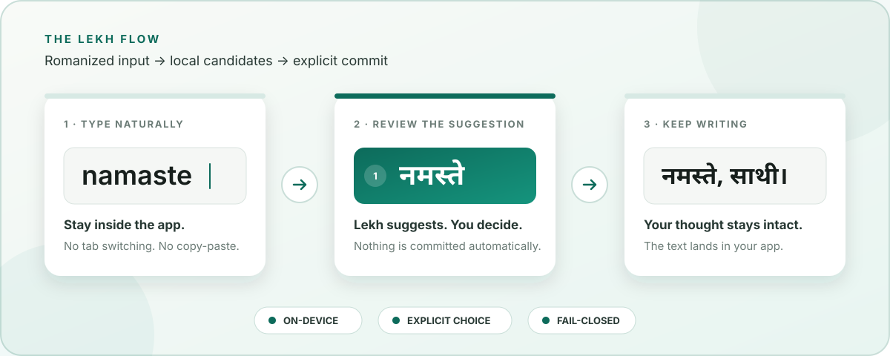
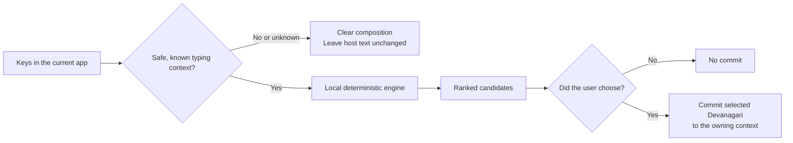

<p align="center">
  
</p>

<h1 align="center">Lekh Assistant</h1>

<p align="center">
  <strong>Write Nepali without breaking your flow.</strong><br />
  <sub>आफ्नो लय नतोडी नेपाली लेख्नुहोस्।</sub>
</p>

<p align="center">
  A private, native typing assistant for macOS and Windows.<br />
  Romanized input becomes deliberate Devanagari suggestions—inside the app where you are already writing.
</p>

<p align="center"><strong>No browser tab. No copy-and-paste loop. No account required.</strong></p>

<p align="center">
  <a href="https://github.com/dantwoashim/Lekh_Assistant/releases/download/v1.0.3/Lekh-Keyboard-Test-Installer.zip">
    
  </a>
  <a href="https://github.com/dantwoashim/Lekh_Assistant/releases/download/v1.0.3/Lekh-Keyboard-Companion-1.0.3-Setup-x64.exe">
    
  </a>
</p>

<p align="center">
  <a href="https://github.com/dantwoashim/Lekh_Assistant/releases/tag/v1.0.3">v1.0.3 release</a>
  ·
  <a href="https://github.com/dantwoashim/Lekh_Assistant/releases/download/v1.0.3/SHA256SUMS.txt">verify downloads</a>
  ·
  <a href="KNOWN_LIMITATIONS.md">known limitations</a>
</p>

<p align="center">
  <a href="https://github.com/dantwoashim/Lekh_Assistant/actions/workflows/ci.yml">
    
  </a>
  <a href="https://github.com/dantwoashim/Lekh_Assistant/releases/tag/v1.0.3">
    
  </a>
  <a href="LICENSE">
    
  </a>
</p>



Most transliteration tools make Nepali a detour: open a website, type, copy,
paste, and repeat. Lekh makes Nepali part of the operating system. Select the
keyboard once, type naturally in Roman letters, and stay with the thought
instead of managing the tool.

Lekh is built around a simple promise: **the software may assist your writing,
but it must never take authority over it.**

- **Stay in the app.** Lekh installs as a native input method, not a web editor.
- **See before committing.** Suggestions remain suggestions until you choose.
- **Keep your writing private.** The v1 typing path works locally, without text
  telemetry, an account, or a network dependency.
- **Preserve the text that should stay Latin.** URLs, email addresses, common
  identifiers, file names, and numbers are guarded from forced conversion.
- **Leave safely.** Switch to another keyboard at any time, or quit the
  companion explicitly.

> [!IMPORTANT]
> **v1.0.3 is an unsigned community preview.** The macOS package is ad-hoc signed but not
> Apple-notarized; the Windows package has no publisher certificate. Gatekeeper
> or SmartScreen warnings are therefore expected. Download only from the
> official release links above and compare the file with the published
> [SHA-256 checksums](https://github.com/dantwoashim/Lekh_Assistant/releases/download/v1.0.3/SHA256SUMS.txt).
> Lekh never asks you to disable operating-system security globally.

## What you get

| Capability | v1.0 behavior |
|---|---|
| Romanized Nepali | Type familiar Latin spellings such as `namaste`; choose from ranked Devanagari candidates such as `नमस्ते`. |
| System integration | Native InputMethodKit input method on macOS; native Text Services Framework text service on Windows. |
| Candidate control | Inline and popup candidates on macOS; numbered, keyboard/pointer-selectable, Narrator-readable candidates on Windows. Nothing commits merely because it appears. |
| Local language tools | Bundled dictionary-backed ranking, local explicit-choice memory, and conservative active-token proofread suggestions. |
| Traditional typing | Traditional → Nepali and Traditional → Romanized on macOS, clearly labeled **Beta**. |
| Privacy boundary | No text telemetry in the v1 typing path. Secure or unknown contexts fail closed and clear composition state. |
| Offline behavior | Typing, suggestions, dictionary ranking, and proofread rules do not require a server or account. |

### Platform support

| Platform | Release target | What ships |
|---|---|---|
| macOS | macOS 13 or newer | One universal installer for Apple Silicon and Intel Macs |
| Windows | Windows 11 x64 | x64 installer with 64-bit and 32-bit native text-service support, a local broker, and the companion |

Windows ARM64 compiles and passes native tests in CI, but v1.0 does not ship an
ARM64 installer because that install lifecycle has not passed the same
verification as x64.

## Install

End users do **not** need Node.js, npm, or a developer toolchain.

### macOS

1. [Download `Lekh-Keyboard-Test-Installer.zip`](https://github.com/dantwoashim/Lekh_Assistant/releases/download/v1.0.3/Lekh-Keyboard-Test-Installer.zip).
2. In Finder, double-click the ZIP once. Keep the extracted **Lekh Keyboard
   Test Installer** folder intact.
3. Open that folder. Control-click or right-click `Lekh Keyboard Test Installer.app`, choose Open, then click Open again.
4. Wait for the success message and click **OK**.
5. Save your work, log out of your Mac, and log back in. macOS can cache a
   newly installed unsigned input method.
6. Open **System Settings → Keyboard**. Beside **Text Input**, click
   **Edit…**, then click **+**.
7. Select **Nepali** on the left, select **Lekh Keyboard** on the right, and
   click **Add**.
8. Choose **Lekh Keyboard** from the input-source menu in the menu bar.

<details>
<summary><strong>If macOS blocks the installer</strong></summary>

Use these options in order:

1. Repeat the Finder **right-click → Open** flow. Do not start with a normal
   double-click.
2. Open **System Settings → Privacy & Security**, scroll to **Security**, and
   choose **Open Anyway** for Lekh Keyboard Test Installer.
3. Only if both supported UI paths fail, open Terminal and run this command
   against the installer app itself:

   ```bash
   xattr -dr com.apple.quarantine "/path/to/Lekh Keyboard Test Installer.app"
   ```

   You can drag the installer app into Terminal to insert its exact path.
   Never run this command on Downloads, your home folder, an entire drive, or
   any directory broader than this one installer app. Then repeat
   **right-click → Open**.

</details>

<details>
<summary><strong>If Lekh is missing from Input Sources</strong></summary>

1. Confirm that the installer reported success.
2. Log out and back in; closing System Settings is not enough.
3. Return to **System Settings → Keyboard → Text Input → Edit… → + → Nepali**.
4. If Lekh is still absent, rerun the installer from the complete extracted
   folder, then repeat the logout/login step.

</details>

### Windows

1. [Download `Lekh-Keyboard-Companion-1.0.3-Setup-x64.exe`](https://github.com/dantwoashim/Lekh_Assistant/releases/download/v1.0.3/Lekh-Keyboard-Companion-1.0.3-Setup-x64.exe).
2. Double-click the installer.
3. If Windows says **Windows protected your PC**, click **More info**, confirm
   that the file name is the Lekh installer, and click **Run anyway**.
   If Windows provides no **Run anyway** option, Smart App Control or an
   organization policy is blocking unsigned software. Do not disable device
   security globally; this unsigned preview cannot be installed on that PC.
4. Approve the **User Account Control** prompt. Administrator approval is
   required because the installer registers a machine-wide Windows text
   service.
5. Keep the default install folder, click **Install**, and wait for setup to
   finish.
6. Open **Lekh Keyboard Companion** once and confirm that Keyboard
   registration, Typing service, and Run at sign-in all show **Ready**.
7. Open Notepad, press **Windows key + Space**, and choose **Lekh Keyboard
   Nepali**. Type `namaste`; the inline suggestion should show `नमस्ते`.

Setup adds Lekh to the installing user's Windows input list, but it does not
change the default keyboard or switch input sources without the user.

If Lekh is not listed, open **Lekh Keyboard Companion → Updates & diagnostics**
and choose **Repair text service**. Approve its single UAC prompt, then sign out
and back in once if Windows has not refreshed the input list. Reinstall only if
the companion reports that a required native file is missing.

<details>
<summary><strong>If Lekh is selected but typing stays Latin</strong></summary>

1. Open **Lekh Keyboard Companion → Updates & diagnostics** and confirm that
   Keyboard registration and Typing service both show **Ready**.
2. If registration needs attention, choose **Repair keyboard** and approve its
   UAC prompt.
3. If the service needs attention, choose **Restart typing service**.
4. Confirm **Run at sign-in** is enabled, then retry in Notepad before testing
   Word, a browser, or another editor.
5. If the keyboard was just installed or repaired, sign out and back in once,
   select it again with **Windows key + Space**, and retry.

Lekh intentionally passes Latin text through unchanged when its local service
is unavailable or when Windows reports a secure or unknown typing context. It
never asks users to disable antivirus, SmartScreen, or Smart App Control.

</details>

<details>
<summary><strong>Verify a download before opening it</strong></summary>

Download the official
[`SHA256SUMS.txt`](https://github.com/dantwoashim/Lekh_Assistant/releases/download/v1.0.3/SHA256SUMS.txt)
file, then compare the installer hash.

On macOS:

```bash
shasum -a 256 ~/Downloads/Lekh-Keyboard-Test-Installer.zip
```

On Windows PowerShell:

```powershell
Get-FileHash "$HOME\Downloads\Lekh-Keyboard-Companion-1.0.3-Setup-x64.exe" -Algorithm SHA256
```

</details>

## Type with Lekh

### Romanized → Nepali

1. Select Lekh as the current input source.
2. Type a Nepali word with Roman letters—for example, `namaste`.
3. Review the Devanagari candidates.
4. Choose `नमस्ते`. If you do not choose a suggestion, Lekh does not silently
   commit it.

### macOS controls

| Action | Control |
|---|---|
| Choose Romanized Nepali | Click the **ले** menu → **Romanized → Nepali** |
| Open the mode chooser | **Control + Option + Space** |
| Accept the gray inline completion | **Tab** or **Right Arrow** |
| Open or move through candidates | **Down Arrow**, then **Up/Down** |
| Commit the highlighted candidate | **Return** |
| Choose a visible shortcut | **Option + 1**, **2**, or **3** |
| Keep or cancel to raw text | **Escape** |
| Turn Lekh off | Click the **ले** menu → **Switch to ABC**, or choose another input source |

The same **ले** menu contains **Traditional → Nepali (Beta)** and
**Traditional → Romanized (Beta)**. Their complete physical layout has not
been validated by an experienced Traditional typist, so Romanized → Nepali is
the recommended v1.0 mode.

### Windows controls

| Action | Control |
|---|---|
| Turn Lekh on or switch keyboards | **Windows key + Space** |
| Accept the inline ghost suggestion | **Tab** or **Right Arrow** |
| Move through candidates | **Up/Down Arrow** |
| Choose a numbered candidate | **1–8** |
| Choose with pointer or touch | Click or tap a candidate row |
| Commit the selected candidate | **Space** or **Enter** |
| Cycle Lekh typing modes | **Ctrl + Alt + Space** |
| Choose English letters → Nepali | **Ctrl + Alt + 1** |
| Choose Romanized text | **Ctrl + Alt + 2** |
| Turn Lekh off | **Windows key + Space**, then choose another keyboard |

To stop the Windows background process completely, open **Lekh Keyboard
Companion** from the Start menu and choose **File → Exit Lekh Keyboard
Companion**. Typing then fails open to unchanged Latin input until you reopen
the companion.

## Suggestions, dictionary, and proofread

Lekh v1.0 deliberately favors predictable assistance over aggressive
automation.

- Candidate ranking combines deterministic transliteration, bundled word and
  phrase data, and choices you explicitly accepted on this device.
- Personal learning stores candidate choices, not surrounding sentences.
- The bundled dictionary supports ranking and local lookup, but is not
  presented as an authoritative dictionary with professionally certified
  definitions for every entry.
- Proofread can offer a **Fix** candidate for supported active Nepali tokens.
  It is not a document-wide spelling or grammar checker.
- A missing hint is not a claim that the text is correct. Every correction
  remains an explicit choice.

## Trust is an architecture decision

Lekh does not treat privacy and text safety as marketing settings bolted onto
the end. They shape the commit path itself:



- **Native host boundaries:** macOS uses InputMethodKit; Windows uses Text
  Services Framework. The browser demo is not represented as the system
  keyboard.
- **Secure-field behavior:** password and unknown contexts clear local
  composition and refuse transformation.
- **Bounded authority:** candidate commits are tied to the active session and
  owning text context.
- **Local IPC:** the native input service and companion communicate through
  versioned local contracts; text is not sent to a web service.
- **Reversible preference:** explicit choices may improve local ranking, and
  the user can reset or remove Lekh-owned data.

Read the [security policy](SECURITY.md) for reporting a vulnerability.

## Engineering evidence, not slogans

The v1.0 release is backed by reproducible automation and narrowly worded
claims:

- CI builds and tests macOS on Apple Silicon and Intel, plus Windows on x64 and
  ARM64.
- The deterministic v1 release suite runs on every release candidate through
  `npm run v1:test`; CI output is the source of truth for its current count.
- TypeScript and Swift passed all **31 shared behavior-contract cases** with
  byte-identical output.
- Windows CI commits a selected Devanagari candidate through a real TSF thread
  manager, document manager, context, edit session, and in-memory text store.
- Windows x64 CI installs silently, verifies 64-bit and 32-bit COM/TSF
  registration plus local service startup, uninstalls, and verifies cleanup.
- The macOS package simulation verifies quarantine detection, the preferred
  Finder approval path, universal architecture, and package integrity.
- The final bounded adversarial review recorded **zero open P0 issues**. It
  does not replace the limitations below or claim universal host-app testing.

Explore the evidence:

- [Current CI workflow](https://github.com/dantwoashim/Lekh_Assistant/actions/workflows/ci.yml)
- [Windows release build and physical validation matrix](docs/WINDOWS_RELEASE_BUILD.md)
- [macOS unsigned-install walkthrough](C2_MACOS_UNSIGNED_INSTALL_WALKTHROUGH.md)
- [Traditional / Preeti corpus result](C3_TRADITIONAL_PREETI_CORPUS_RESULTS.md)
- [Known limitations](KNOWN_LIMITATIONS.md)

## Experimental neural research

The repository contains an active local Core ML transliteration research track.
It is **not the v1.0 product**, is **not production-ready**, is off by default,
and is absent from the published v1.0 packages. The deterministic engine remains
the shipping path.

Current research evaluates candidate architectures and an evidence-bound
promotion pipeline. No model will be described as Neural Engine-backed merely
because Core ML was asked to make the Neural Engine available; actual placement
and final packaged performance still require proof.

See the
[latest neural production-readiness checkpoint](docs/neural/NEURAL_PRODUCTION_READINESS_CHECKPOINT_2026-07-28.md)
for measured results, resolved findings, and remaining blockers.

## Known limitations

Honest limits are part of the product contract:

- The macOS package is not Apple-notarized, and the Windows package is
  unsigned.
- Physical Windows behavior in Notepad, browsers, and Microsoft Word has not
  been claimed as visually verified; the native commit path and candidate state
  machine use automated CI proxies.
- The companion and installer target Windows 11 x64. The installer includes a
  separate x86 TSF DLL so the keyboard can load in 32-bit applications; a
  Windows ARM64 installer is not yet shipped.
- Traditional typing is Beta and lacks a verified physical-layout corpus and
  experienced-typist sign-off.
- The Preeti converter has extensive locked-fixture regression coverage but no
  consented real-document validation set.
- Proofread is conservative active-token assistance, not full grammar
  correction.
- v1.0 has no automatic update service.

The complete release-honesty record is in
[KNOWN_LIMITATIONS.md](KNOWN_LIMITATIONS.md).

## Uninstall

### macOS

Switch to ABC first. Open the original extracted installer folder, right-click
**Lekh Keyboard Uninstaller.app**, choose **Open**, and confirm removal. The
uninstaller removes the input method and Lekh-owned local data, including
learned words, packs, backups, caches, and logs.

### Windows

Open **Settings → Apps → Installed apps**, find **Lekh Keyboard Companion**,
open its **…** menu, and choose **Uninstall**. Approve the User Account Control
prompt. The uninstaller stops the companion and broker, removes startup
registration, unregisters the text service, and removes installed files.

---

## Build from source

Everything below is for contributors. End users should use the release
installers above.

### Prerequisites

- Node.js 24
- npm 11
- macOS: Xcode Command Line Tools and a compatible macOS SDK
- Windows: Visual Studio Build Tools, CMake, and the Windows SDK

```bash
git clone https://github.com/dantwoashim/Lekh_Assistant.git
cd Lekh_Assistant
npm ci
npm run v1:check
```

### Primary v1 command surface

These eight commands are the documented top-level v1 entry points. Lower-level
maintenance and research scripts remain in `package.json` for maintainers.

| Command | Purpose | Host |
|---|---|---|
| `npm run v1:dev` | Start the local development surface | macOS / Windows |
| `npm run v1:build` | Build the web and companion UI | macOS / Windows |
| `npm run v1:test` | Run the deterministic v1 test suite | macOS / Windows |
| `npm run v1:check` | Run format, types, tests, build, IPC, and commit-policy checks | macOS / Windows |
| `npm run v1:build:macos` | Compile the native macOS input method with neural typing off | macOS |
| `npm run v1:build:windows` | Compile and test both 64-bit and 32-bit Windows TSF services | Windows |
| `npm run v1:package:macos` | Build and verify the unsigned universal installer ZIP | macOS |
| `npm run v1:package:windows` | Build the unsigned x64 Windows installer | Windows |

### Repository map

```text
src/                         Deterministic engine and focused UI
native/macos-imk/skeleton/   macOS InputMethodKit implementation
native/windows-tsf/skeleton/ Windows Text Services Framework implementation
native/daemon/               Local deterministic daemon
native/shared/               IPC and local-storage contracts
scripts/                     Build, packaging, and verification automation
data/                        Bundled deterministic language data
docs/                        Architecture, safety, research, and release records
```

Architecture truth matters:

- The macOS keyboard is the InputMethodKit input method.
- The Windows keyboard is the TSF text service.
- The companion configures and supports the keyboard; it is not the keyboard.
- The Electron/browser surface is a development and demonstration surface; it
  is not the system keyboard.
- Preeti-to-Unicode conversion is a side utility, not the main typing path.

### Contribute

Before opening a change, read:

- [Contributing guide](CONTRIBUTING.md)
- [Security policy](SECURITY.md)
- [Third-party notices](docs/THIRD_PARTY_NOTICES.md)

## License

Lekh Assistant is available under the [MIT License](LICENSE).

<p align="center">
  <strong>Your words. Your device. Your choice.</strong>
</p>
