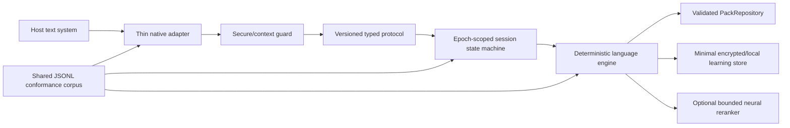

# Lekh Audit Synthesis and Noble Engineering Plan

Updated: 2026-07-17

Status: frozen on 2026-07-18 with zero active Noble-plan issues; v1 work is limited to the finite release checklist and all remaining programme work is deferred.

## Executive decision

The supplied audits are valuable, but none is safe to use alone as the engineering backlog. The strongest working method is:

1. use the `542e23c` forensic audit as the architectural and security threat catalogue;
2. use the two-part Noble Masterplan as the maintainability and organizational-debt catalogue;
3. use the repository's executable audit as the evidence baseline;
4. revalidate every claim against the current revision before assigning severity;
5. turn validated risks into executable invariants, tests, release gates, and owned work.

This document is the synthesis. It does not claim that a famous expert reviewed Lekh, that an automated test replaces a Nepali-language authority, or that an unsigned macOS build is production-equivalent.

## What “Noble Software” means here

For Lekh, nobility is not visual polish or a large feature count. It is an observable standard:

- no user's keystroke is silently lost, duplicated, reordered, or leaked;
- uncertain behavior fails open and preserves the host application's input path;
- secure and uncertain fields retain no text and perform no learning;
- language behavior is approved by representative Nepali typists and linguists;
- every release claim is backed by reproducible evidence;
- installation and trust limitations are disclosed before the user takes a risk;
- macOS and Windows are real native keyboards, not demos described as keyboards;
- architecture makes the safest change the easiest change;
- local-first privacy remains the default, including for suggestions and neural work;
- accessibility, reversibility, and respectful failure messages are product requirements.

## Comparative usefulness

Scores are decision aids, not objective grades.

| Source | Strongest contribution | Main limitation | Best use | Utility now |
| --- | --- | --- | --- | --- |
| `Lekh_Assistant_Forensic_Audit_and_Noble_Engineering_Plan_542e23c.md` | Broad 120-item inventory; strong invariants, trust-boundary analysis, failure semantics, and native architecture questions | Pinned to an older revision; no executed verification; severity mixes active defects, dormant scaffold gaps, intentional fail-closed behavior, and platform constraints | Threat catalogue and architectural constitution | 9/10 for breadth; 7/10 as a current defect list |
| Two-part `LEKH KEYBOARD — THE NOBLE SOFTWARE MASTERPLAN` | Strong decomposition, documentation, data-loading, project-graph, and maintainability observations; useful 60-item prioritization | Several claims are stale or overgeneralized; arbitrary numerical targets can encourage cosmetic refactors | Maintainability programme and review prompts | 8/10 for debt discovery; 5/10 for current factual precision |
| `LEKH_KEYBOARD_FULL_PROJECT_AUDIT.md` | Executed commands, reproducible evidence, product-truth separation, and direct native-release blockers | Smaller 23-item set; less exhaustive source-level architecture/security analysis; some conclusions predate the latest macOS work | Evidence baseline and release decision record | 9/10 for evidence; 7/10 for architectural depth |
| This synthesis | Current-source validation plus the broadest useful ideas, executable invariants, implementation, and measurable release gates | Still cannot replace real Windows/macOS host testing or human language approval | Canonical programme | Highest-confidence working plan |

## Corrections that materially change prioritization

### TypeScript is not currently unbuildable

`tsc -b --noEmit` passes on the supported runtime. A forced clean run is memory-heavy and slow, so giant static data imports and overlapping project graphs remain important architectural debt. They are not a current stop-ship compiler failure.

### Giant packs do not all ship in the companion bundle

Some large data paths affect the browser lab and daemon paths rather than the native companion application. Each budget must therefore be attached to a named artifact instead of treating every import as a shipping macOS payload.

### A neural model exists, but Neural Engine use is not proven

The experimental macOS archive contains a local Core ML model and currently requests `.all` compute units. That does not demonstrate that Apple Neural Engine executed a workload, improved quality, or met a production latency/energy gate. `productionEligible` remains false.

### Homebrew cannot solve Apple trust

Homebrew can install developer utilities. It cannot turn an ad-hoc signature into an Apple Developer ID identity, notarize Lekh, or eliminate Gatekeeper approval. The community channel must be explicitly unsigned and manually approved.

### Recursive quarantine deletion is not an acceptable installer design

Instructions must not ask testers to recursively remove quarantine from a release tree. Lekh instead authenticates a private metadata-clean snapshot with a pinned project key, verifies the closed-world inventory and code signature, and explains the remaining Apple trust limitation.

### A Rust rewrite is not the first architectural move

Rewriting an engine before defining observable semantics merely moves disagreement into a new language. First establish one versioned conformance corpus. Then decide whether TypeScript, Swift, C++, Rust, generated tables, or a hybrid boundary offers the best safety and maintenance profile.

### Named experts are lenses, not participants

The following real people provide useful intellectual lenses; none is represented as having reviewed or endorsed Lekh:

| Lens | Applied question |
| --- | --- |
| Leslie Lamport | What state machine and invariants remove ambiguity from sessions, ordering, cancellation, and commits? |
| Nancy Leveson | Which unsafe control actions can lose text, expose secure input, or produce misleading installation state? |
| John Ousterhout | Which modules hide complexity, and which interfaces leak representation and policy everywhere? |
| Ross Anderson | Who bears the cost when trust, update, IPC, or storage controls fail? |
| Kent Beck | What smallest executable characterization makes the next refactor safe? |
| Martin Fowler | Where can a strangler boundary replace a risky rewrite? |
| Don Norman | Does installation, approval, selection, recovery, and uninstall match the user's mental model? |

Traditional-layout and language correctness require real Nepali practitioners. No software-design lens can manufacture that authority.

## Non-negotiable system invariants

### Input safety

1. A native adapter consumes a key only after it can apply equivalent text or a deliberate command.
2. Unknown context, timeout, protocol error, crash, and unsupported host state fail open.
3. All ranges are UTF-16 host ranges and must also land on extended grapheme boundaries.
4. Every commit, replacement, and delete is atomic at the host boundary.
5. Late responses from an obsolete focus/session epoch cannot mutate the active document.

### Privacy

1. Password, code, private, and uncertain contexts produce no candidates, proof hints, learning, history, logs, or retained surrounding text.
2. A transition into a secure/uncertain context purges all session text atomically.
3. Telemetry, if ever introduced, is opt-in and cannot carry typed text or reconstructable context.
4. Storage keeps normalized learning signals, not sentences or document fragments.

### Trust and release

1. Every archive is bound to a clean source revision.
2. The complete release inventory is signed by the published project key and verified closed-world.
3. Project-key authentication is never described as Apple identity or notarization.
4. Auto-update remains disabled until the shipping native product has an authenticated, rollback-capable updater.
5. Build-from-source, Community Unsigned Preview, and Apple-trusted production are distinct channels.

### Architecture

1. One versioned behavior corpus defines cross-platform engine semantics.
2. IPC is untrusted input: exact message type, exact keys, bounded values, typed nested payloads, and explicit version negotiation.
3. Persistence formats are truthful; `.sqlite3` always contains SQLite and `.json` always contains JSON.
4. Generated schemas, validators, and platform bindings derive from one protocol source.
5. Performance claims name the artifact, hardware, data, build, and percentile being measured.

## Implementation completed in this hardening pass

### Grapheme-safe editing

- TypeScript range validation now rejects offsets inside extended grapheme clusters.
- Range clamping, backward deletion, and forward deletion use grapheme boundaries.
- Tests cover Devanagari matras, virama conjuncts, emoji modifiers, ZWJ families, `NaN`, and infinity.

### Secure and uncertain context lifecycle

- `unknown` fields now use the secure fail-closed policy.
- Starting or entering a secure/uncertain field clears context windows, composition, candidates, proof hints, history, and last-committed text.
- Later mutation calls cannot reintroduce sensitive state.
- Secure pass-through neither echoes nor retains the raw input in engine state.

### Ordered daemon protocol

- Named-pipe requests and responses are serialized in arrival order.
- One failed request does not poison subsequent queue work.
- The five-second disconnect was replaced with a documented development timeout pending an epoch-aware lifecycle design.

### Exact IPC validation

- All 17 request types receive exact runtime validation before daemon dispatch.
- Unknown keys, inherited-property enum names, invalid nested objects, unsafe numbers, oversized strings/arrays, and invalid dates are rejected.
- No-argument wire payloads use JSON-safe `null`.
- A malformed hot-path request cannot invoke the engine or increment request counters.
- `memory.learn` accepts only a one-time server-issued `{sessionId, commitEpoch}` receipt for an already-recorded, explicitly non-secure commit. The untrusted client cannot submit memory text, surrounding context, timestamps, or ranking data.

### Truthful storage format

- The TypeScript SQLite adapter no longer falls back to writing JSON bytes into `.sqlite3`.
- Unsupported runtimes fail closed and direct developers to an explicitly named JSON store/path.
- Tests assert the SQLite header, `PRAGMA quick_check`, reopen behavior, and byte-preserving rejection of an existing non-SQLite file.

### Self-contained unsigned-release authentication

- A bundled CryptoKit helper validates the legacy Ed25519 Minisign packet without requiring Homebrew or a tester-installed verifier.
- The helper's own SHA-256 hash is pinned by the launcher.
- The launcher snapshots the release into a private metadata-clean directory before executing the helper.
- The installer snapshots and authenticates the exact closed-world release whose existing code signature it later verifies before execution.
- Packaging tests exercise tampered payloads, tampered helpers, unlisted files, and a synthetically quarantined extracted verifier path.
- Installer language distinguishes installation, registration request, System Settings approval, logout/login, and actual user selection.

### Reproducible development runtime

- Node 24 is pinned for local work and npm 11.8.0 is recorded.
- The minimum Node engine is 22.5, the first release line providing the required `node:sqlite` API.

### Experimental neural input admission

- Exact inputs owned by the deterministic token pack bypass the neural tail.
- A missing deterministic pack gates neural inference entirely.
- Inputs must leave an explicit EOS slot and every grapheme token must exist in the verified vocabulary.
- The Core ML encoder repeats the length and representability checks so an internal caller cannot silently truncate or emit lossy `<unk>` input.
- These controls leave `productionEligible` false and do not claim that Apple Neural Engine executed the workload.

## Target architecture

The native adapter owns host-specific focus, edit-session, marked-text, selection, and candidate-window mechanics. The deterministic engine owns language semantics. Neural output is optional, bounded, cancellable, and never authoritative for secure-field or fail-open decisions.

## Phased execution plan

### Phase 0 — Freeze truth and protect the community preview

Deliverables:

- commit the current hardening work;
- build a fresh universal archive from that clean revision;
- authenticate the extracted archive through the bundled verifier;
- test install, approval, logout/login, selection, typing, and uninstall from a clean account;
- keep the tester message explicit about unsigned/unnotarized risk and incomplete Windows/Traditional scope.

Exit gate:

- no release-integrity, shell-syntax, code-sign, privacy-policy, or product-truth failure;
- a signed evidence report records source revision, archive hash, architectures, model status, and manual QA gaps.

### Phase 1 — Specify behavior before changing architecture

Deliverables:

- a versioned JSONL corpus for key events, mode transitions, Romanized/Traditional output, protected spans, candidates, secure transitions, commits, cancellations, and failures;
- independent runners for TypeScript and Swift, followed by Windows;
- a differential report with zero unexplained divergence;
- mutation and property tests for grapheme/range/session invariants.

Exit gate:

- every supported semantic change adds or updates corpus evidence;
- no engine rewrite begins while observable behavior remains implicit.

### Phase 2 — Build one real Windows vertical slice

Deliverables:

- focus and session lifecycle wired to the daemon;
- keyboard translation using the active Windows layout rather than raw virtual-key assumptions;
- `ITfEditSession` ownership, composition start/update/commit/cancel, caret/selection tracking, and candidate application;
- password/private input-scope suppression and fail-open timeout/crash behavior;
- Notepad plus a dedicated password-field host in automated/manual QA.

Exit gate:

- a Romanized word can be composed, corrected, committed, deleted, and cancelled without loss in both hosts;
- the service never eats a key when text application did not succeed.

### Phase 3 — Complete protocol, identity, lifecycle, and persistence

Deliverables:

- generate TypeScript/Swift/C++ bindings, validators, and JSON Schema from one protocol source;
- user-only Windows pipe ACL, server identity verification, request correlation, deadlines, bounded queues, and session epochs;
- protocol version negotiation and typed failure actions;
- versioned SQLite migrations with transactional copy-and-promote, rollback, corruption recovery, permissions, and concurrent-process tests;
- bounded, privacy-reviewed learning with per-context policy and deletion/export controls.

Exit gate:

- fuzzing and hostile-client tests cannot mutate state before validation;
- forced crash, timeout, stale response, storage corruption, and downgrade tests preserve user text and recovery data.

### Phase 4 — Native matrices and human language authority

Deliverables:

- macOS Swift build/probes and Windows C++/TSF build/tests in CI;
- risk-based host matrix covering native editors, Chromium, Electron, Office-class editors, accessibility clients, secure fields, and remote/virtualized input where feasible;
- pairwise OS/architecture/host/mode coverage instead of an unbounded Cartesian matrix;
- Traditional/LTK physical-layout capture and approval by experienced typists;
- Nepali linguistic review of aliases, corrections, dictionary meanings, ambiguous Romanization, names, and code-mixed behavior.

Exit gate:

- no open P0/P1 native-input defect;
- agreed pass rates and error taxonomy signed off by named internal owners and external language reviewers.

### Phase 5 — Prove or demote neural behavior

Deliverables:

- frozen train/dev/test provenance with leakage checks;
- deterministic baseline versus neural quality, latency, memory, energy, and binary-size comparison;
- on-device measurements on Apple Silicon and Intel fallback behavior;
- actual compute-device evidence where the platform exposes it;
- bounded cancellation and deterministic fallback on model absence, timeout, or malformed output.

Exit gate:

- neural promotion occurs only if it improves a named user metric within hard latency/privacy budgets;
- otherwise it remains experimental or is removed from the shipping artifact.

### Phase 6 — Reduce accidental complexity safely

Deliverables:

- a validated lazy `PackRepository` in place of giant eager static imports;
- separate project graphs and bundle budgets for browser lab, daemon, companion, tests, and native release tooling;
- a small task runner or grouped scripts replacing duplicate npm orchestration;
- living documentation with generated inventories and archived historical reports;
- decomposition of god files by independent change reason, not arbitrary line count;
- domain-specific candidate/result types with explicit adapters instead of a universal mega-type.

Exit gate:

- clean typecheck/build fits an agreed memory/time budget;
- each shipping artifact has an enforced size/data boundary;
- architectural ownership and dependency direction are mechanically checked.

## Liberating Structures operating model

These are working-session formats, not decoration:

1. **TRIZ:** list everything that would guarantee lost keystrokes, leaked private text, an untrustworthy installer, or a fake production claim. Search the code/process for those behaviors and eliminate them first.
2. **Min Specs:** maintain the non-negotiable invariants above as the smallest release constitution. Teams may innovate freely inside them.
3. **Critical Uncertainties:** explicitly map Apple trust/no-Developer-ID constraints, host text-system variability, Windows TSF mechanics, Traditional-layout authority, and Neural Engine evidence. Fund reversible experiments for each.
4. **Ecocycle Planning:** classify features, scripts, docs, scaffolds, and models as birth, maturity, creative destruction, or renewal. Archive or delete abandoned duplications only after ownership and recovery are clear.
5. **1-2-4-All:** independently collect Romanization/Traditional/dictionary edge cases, converge in small groups, then adopt only examples with provenance and expected behavior.
6. **Wise Crowds:** bring a concrete native-input or language ambiguity to several practitioners; the owner listens before deciding and records dissent.
7. **What, So What, Now What:** after every host-matrix run or pilot, separate observations from interpretation and the next bounded change.

## Release branches under the no-Developer-ID constraint

| Channel | What it can honestly promise | What it cannot promise |
| --- | --- | --- |
| Build from source | Transparent source, pinned tooling, local build and tests | Easy consumer installation or Apple trust |
| Community Unsigned Preview | Project-key-authenticated bits, ad-hoc integrity, manual QA, explicit instructions | Notarization, ordinary Gatekeeper flow, production auto-update, zero-warning installation |
| Apple-trusted production | Reserved future channel requiring Developer ID/notarization | Cannot be simulated with Homebrew, `xattr`, ad-hoc signing, or wording |

The first two channels are legitimate engineering outputs. They must never be relabeled as the third.

## Programme scorecard

Track trends rather than vanity totals:

- keystroke loss/duplication/reordering incidents: target zero;
- secure-context retention violations: target zero;
- unexplained cross-engine corpus divergence: target zero;
- native P0/P1 defects at release: target zero;
- host-matrix pass rate by risk tier;
- Traditional-layout and dictionary items with human provenance;
- p50/p95/p99 key-to-marked-text and commit latency on named hardware;
- crash recovery and stale-response rejection success;
- clean build time and peak memory by project graph;
- archive size and loaded pack memory by shipping artifact;
- truthful-claim lint failures: target zero;
- preview install/use/uninstall completion rate, with failure reasons.

## Work deliberately not declared complete

- Windows is not yet a usable keyboard.
- Traditional physical layout is not yet authoritatively validated.
- Suggestions, proofreading, and dictionary meanings are not certified across representative hosts.
- Neural Engine execution and user benefit are not proven.
- The unsigned macOS preview is not Apple-trusted production software.
- A clean-account macOS install/use/uninstall matrix and external tester evidence remain required for the next archive.

Those are programme inputs, not wording problems. Lekh becomes exceptional by closing them with evidence rather than hiding them.
