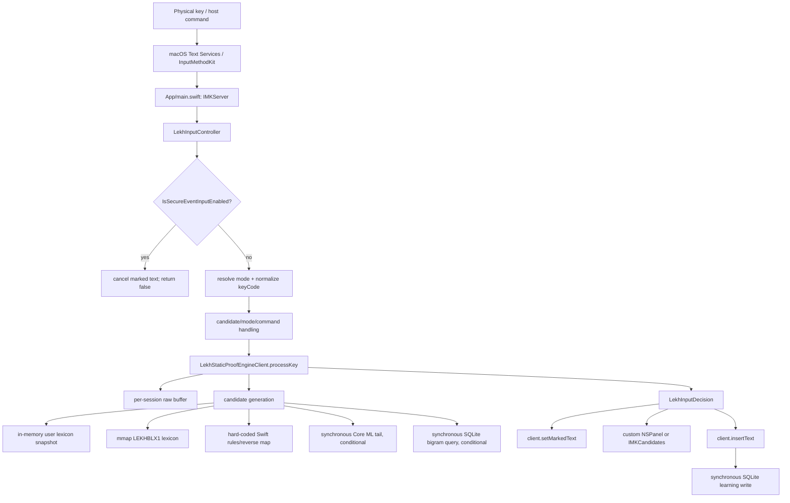
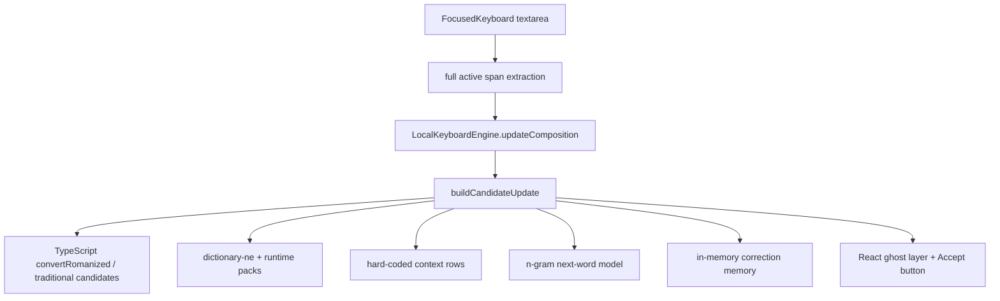
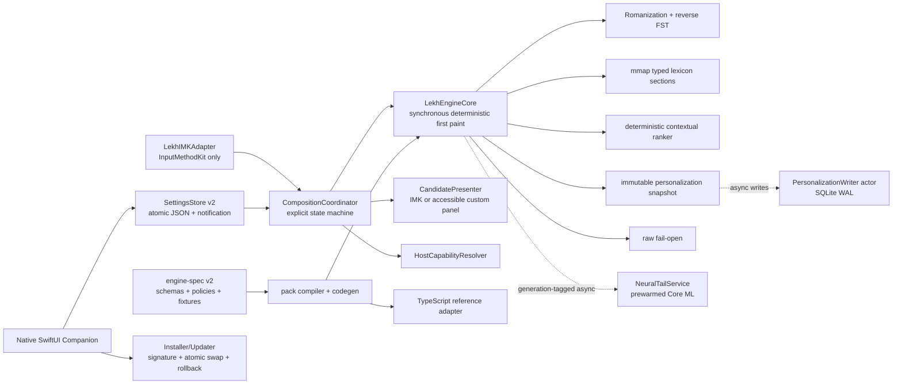

# Lekh Keyboard: Level-1 to Level-5 Forensic Transformation Report

Date: 2026-07-04  
Scope: current checkout at commit `71a5eec` plus locally present generated artifacts, installed IMK bundle, and retained reports  
Classification: Level 1 as an integrated product. Several isolated components are more mature, but they do not form one verified keyboard.

## 2026-07-04 C01-C09 remediation update

The forensic sections below preserve the audited `71a5eec` baseline. They are historical evidence, not a description of the modified worktree. The first critical tranche now has these dispositions:

| ID | Disposition | Implementation evidence |
|---|---|---|
| C01 | Fixed at the contract/data boundary. Swift remains an in-process native engine by design; Swift and TypeScript now consume `data/engine/lekh-engine-contract.v1.json`, and the native package includes that contract plus the same sanitized runtime pack compiled for native lookup. | `data/engine/lekh-engine-contract.v1.json`; `src/engine/keyboard/modes.ts`; `src/engine/keyboard/candidates.ts`; `LekhEngineCore.swift`; `package-macos-imk-dev.mjs` |
| C02 | Fixed. The fake-XPC name and timeout contract were removed; the implementation is now `LekhNativeEngineClient` in `LekhEngineCore.swift`. There is no synchronous XPC dependency. | `LekhEngineCore.swift`; `LekhInputController.swift`; `Package.swift` |
| C03 | Fixed by correct macOS separation. The Windows daemon remains Windows-only; macOS companion status/settings now use allowlisted Electron IPC while keystrokes stay in the in-process IMK engine. | `electron/main.cjs`; `electron/preload.cjs` |
| C04 | Fixed. Electron renders `CompanionShell`; a non-Electron browser continues to render the typing lab and is not represented as the installed keyboard. | `src/app/App.tsx`; `src/features/companion/CompanionShell.tsx` |
| C05 | Fixed for the critical companion boundary. The preload can read native status/preferences, write only allowlisted Boolean preferences, open Keyboard Settings, and reveal the installed bundle. It still does not perform privileged installation. | `electron/preload.cjs`; `electron/main.cjs`; `src/vite-env.d.ts` |
| C06 | Fixed. TypeScript sessions now carry four distinct mode IDs and mode-specific candidate surfaces rather than collapsing to two session modes. | `src/engine/keyboard/types.ts`; `modes.ts`; `candidates.ts`; `FocusedKeyboard.tsx` |
| C07 | Partially fixed without fabrication. Browser/daemon Traditional physical keymap remains pass-through until authoritative layout data exists. Native Traditional modes now first process host-emitted Devanagari Unicode and, when the host still supplies Latin despite the layout override, translate physical key codes through installed macOS Devanagari layout data using `UCKeyTranslate`. Shipping a guessed LTK map remains forbidden. | `src/engine/traditional/keymap.ts`; pending layout artifacts; `LekhInputController.swift`; `LekhKeyboardLayoutTranslator.swift` |
| C08 | Fixed. The guessed Swift Traditional fallback table was deleted. | `LekhInputController.swift` |
| C09 | Fixed. Native key parsing preserves host-provided case, and the engine stores the original source character rather than lowercasing the composition buffer. | `LekhInputController.swift`; `LekhEngineCore.swift` |

Additional critical safety work completed in the same tranche: raw-safe Space/Enter/Tab/Escape, explicit-only candidate acceptance, stale selection reset, eight accessible candidate rows, token-to-phrase suppression, proofread JSON packaging, strictness wiring, production-ineligible Core ML exclusion, prebuilt reverse indexes, asynchronous SQLite writes, secure-field callback guards, personalization pause/exclusions, atomic dev replacement, TIS-only registration, dynamic bundle versions, hardened-runtime companion entitlements, and an explicit notarization/stapling gate.

## Executive verdict

At the audited baseline, Lekh was not one engine behind several surfaces. It was at least three materially different products:

1. the macOS IMK process, which runs a local Swift engine named `LekhStaticProofEngineClient`;
2. the TypeScript `LocalKeyboardEngine`, used by the browser typing lab and Windows daemon;
3. an Electron companion shell that currently renders that browser typing lab and exposes no settings/install bridge.

The real macOS hot path never invokes the TypeScript engine or the Windows daemon. `LekhXpcClient.swift` contains no XPC connection. The native binary shares a generated lexicon source with TypeScript, but not its candidate pipeline, context model, n-gram model, mode semantics, or ranking logic. This architectural fork is the dominant cause of native/browser divergence.

The current checkout does contain useful foundations: an IMK controller that builds, a memory-mapped binary lexicon with structural and signature verification, local SQLite personalization, a compiled Core ML artifact, fail-open branches, and ad-hoc packaging/rollback work. Those foundations do not establish production readiness. The checked-in host matrix contains zero host-app evidence, both retained TextEdit automation probes produced no text, the installed IMK is ad-hoc signed and rejected by Gatekeeper, the companion artifact fails code-sign verification, and the production model gate explicitly fails.

The Level-5 design below keeps all typing deterministic and in-process, moves disk writes and model inference off the first-paint path, makes the four modes genuinely distinct, generates both Swift and TypeScript behavior from one canonical engine specification, and treats signed host-app evidence—not source presence—as the release criterion.

## 1. Current Level-1 architecture and actual runtime call graph

### 1.1 Actual macOS call graph



Evidence:

- `Info.plist` names `LekhInputController` as the server controller: `native/macos-imk/skeleton/Info.plist:31-38`.
- `main.swift` creates the `IMKServer`: `native/macos-imk/skeleton/App/main.swift:16-40`.
- IMK constructs the controller, which calls `defaultEngineClient()`: `native/macos-imk/skeleton/LekhInputController.swift:70-88`.
- That default is unconditionally `LekhStaticProofEngineClient`: `native/macos-imk/skeleton/LekhInputController.swift:86-88`.
- Key paths converge in `processKeyInput`: `native/macos-imk/skeleton/LekhInputController.swift:172-285`.
- Secure Event Input is checked before processing: `native/macos-imk/skeleton/LekhInputController.swift:215-219`.
- The engine call is synchronous on the IMK path: `native/macos-imk/skeleton/LekhInputController.swift:462-477`.
- The engine owns raw buffers and candidate construction: `native/macos-imk/skeleton/LekhXpcClient.swift:484-497,572-775`.
- Marked text and committed text are sent to the host at `native/macos-imk/skeleton/LekhInputController.swift:1086-1123`.
- Candidate commits synchronously learn and then insert: `native/macos-imk/skeleton/LekhInputController.swift:1231-1240`.

### 1.2 What is not in the macOS runtime

The Swift package has no package dependency on the TypeScript engine, daemon, or an XPC service; it compiles only the listed Swift sources (`native/macos-imk/skeleton/Package.swift:12-50`). There is no `NSXPCConnection`, Mach service, socket, or XPC protocol in `native/macos-imk`. The file named `LekhXpcClient.swift` is therefore a misleading name, not an IPC implementation.

The TypeScript daemon imports `createKeyboardEngine()` (`native/daemon/src/keyboardDaemon.ts:1-2,40-54`), but Electron starts that daemon only on Windows (`electron/main.cjs:79-95`). macOS neither launches nor calls it.

### 1.3 Actual TypeScript/browser path



Evidence:

- The shipped React entry point renders only `FocusedKeyboard`: `src/app/App.tsx:1-5`.
- The typing lab creates its own in-process TypeScript engine: `src/features/typing/FocusedKeyboard.tsx:74-86`.
- It passes full active spans, including up to nine words, to `updateComposition`: `src/features/typing/FocusedKeyboard.tsx:140-150,426-460`.
- TypeScript candidate construction uses the richer converter, dictionary, runtime packs, context predictor, and helper candidates: `src/engine/keyboard/candidates.ts:126-202`.
- TypeScript next-word prediction imports `ngram-lm.json`: `src/engine/keyboard/ngramLanguageModel.ts:1-4,51-75`.

### 1.4 Composition, candidates, insertion, and persistence today

At the retained Level-1 audit baseline, the native session had a Latin/Devanagari string buffer keyed by UUID, a candidate list, and a Boolean `candidateSelectionExplicit`; it did not have an explicit composition-state enum. The current implementation has replaced Boolean commit authority with snapshot-bound acceptance receipts.

Native candidate order is:

1. protected-token preservation;
2. user lexicon;
3. hard-coded demonstration rows;
4. exact binary lexicon;
5. hard-coded prefix rows;
6. binary prefix/tolerance matches;
7. deterministic Swift composer;
8. compiled Core ML tail if prior sources returned too few candidates;
9. user-bigram reordering.

That order is implemented at `native/macos-imk/skeleton/LekhXpcClient.swift:701-774`. It is not the TypeScript order or schema.

Personalization is stored in `~/Library/Application Support/Lekh Keyboard/lekh-keyboard.sqlite3` (`native/macos-imk/skeleton/LekhXpcClient.swift:1059-1068`). Accepted non-identity candidates are recorded in `user_lexicon`, and cross-token commits are recorded in `user_bigrams` (`native/macos-imk/skeleton/LekhXpcClient.swift:1093-1129`). Ranking can synchronously query SQLite during typing (`native/macos-imk/skeleton/LekhXpcClient.swift:1131-1146,1267-1289`).

### 1.5 Source and asset inventory

The tracked checkout contains 721 files, including 20 Swift, 250 TypeScript, 26 TSX, 89 JSON, 41 JSONL, and 5 TSV files. Runtime relevance is:

| Asset family | Actual consumer | Audit result |
|---|---|---|
| `native/macos-imk/skeleton/*.swift` | macOS IMK executable | The 13 library sources are explicitly enumerated at `Package.swift:33-47`; `App/main.swift` is the executable entry point. |
| Installer Swift/shell sources | dev/test installer scripts | Separate from the IMK executable via `Package.swift:17-31`; production behavior must be assessed from package scripts, not the Swift library build. |
| `src/engine/**`, `src/core/**` | browser lab and Windows daemon | Not linked into macOS. The daemon imports the TypeScript keyboard engine at `native/daemon/src/keyboardDaemon.ts:1-2`. |
| `src/data/keyboard-packs/v0.1/runtime-suggestions.json` | TypeScript directly; macOS indirectly after sanitization/binary compilation | Source has words, phrases, proofread, names, next contexts, and mixed policy; LKB1 compiler keeps only phrases/words/names (`compile-runtime-lexicon-binary.mjs:97-105`). |
| `ngram-lm.json` | TypeScript only | Imported at `ngramLanguageModel.ts:1`; not copied to IMK. |
| `prediction-model.json` | TypeScript runtime-pack ranking only | Imported at `runtimePacks.ts:1-2`; not copied to IMK. |
| `data/keyboard-corpus/runtime/v0.1/*` | Corpus-build intermediate/output | Produced by curation at `scripts/curate-keyboard-corpus.mjs:670-693`; only the bundled runtime pack is later consumed. |
| `data/layouts/*.pending.json` | Audit metadata | Both have empty key arrays and `implementationAllowed=false` (`traditional-ltk-compatible.pending.json:4-24`; `traditional-standard.pending.json:4-24`). |
| `models/macos/LekhNeuralTransliterator.mlmodelc` | Packaged native Core ML tail | Copied conditionally at `package-macos-imk-dev.mjs:247-264`; invoked only at `LekhXpcClient.swift:752-763`. |
| `data/generated/coreml-student/*.mlmodel` and teacher `.pt` | Local ignored training artifacts | Not tracked; production provenance cannot depend on their mere local presence. The tracked compiled model and manifest under `models/macos` are the shippable evidence. |
| Hunspell `dictionary-ne` expansion | TypeScript dictionary and runtime-pack build inputs | Registry marks imported rows unreviewed and lower-priority at `src/engine/lexicon/sourceRegistry.ts:16-26`; provenance is at `data/lexicon/generated/hunspell-ranked-nepali.provenance.json:1-12`. |
| Phrase/domain JSONL and alias TSV | Build/evaluation inputs | Native does not read these directly. Their only native effect is through the compiled pack. |
| Preeti maps/converter | browser/document utility | No macOS IMK import or package path; it is not a native keyboard mode. |

## 2. Confirmed, inferred, and unknown problems

### 2.1 Confirmed from code or retained artifacts

| ID | Confirmed finding | Evidence |
|---|---|---|
| C01 | macOS never calls the TypeScript engine. | `LekhInputController.swift:70-88`; `Package.swift:12-50` |
| C02 | `LekhXpcClient.swift` is not an XPC client. | Protocol/static implementation at `LekhXpcClient.swift:33-42,453-572`; no XPC API in the macOS source |
| C03 | The Electron companion starts its daemon only on Windows. | `electron/main.cjs:79-95` |
| C04 | The companion renders the browser typing lab, not `CompanionShell`. | `src/app/App.tsx:1-5`; unused shell at `src/features/companion/CompanionShell.tsx:21-157` |
| C05 | The preload exposes metadata only; it cannot read/write native preferences, install the IMK, inspect TIS state, or manage the SQLite dictionary. | `electron/preload.cjs:1-12` |
| C06 | Four UI labels collapse to two TypeScript engine modes. | `FocusedKeyboard.tsx:23-47` maps both Romanized outputs to `"romanized"` and both Traditional outputs to `"traditional"` |
| C07 | The TypeScript Traditional physical keymap is deliberately nonfunctional. | `src/engine/traditional/keymap.ts:5-23`; layouts are pending at `src/engine/traditional/layout.ts:3-24` |
| C08 | Swift nevertheless ships a guessed/hard-coded Traditional fallback. | `LekhInputController.swift:861-936`; source artifacts prohibit implementation at `data/layouts/traditional-ltk-compatible.pending.json:4-24` and `traditional-standard.pending.json:4-24` |
| C09 | Shift is discarded for Romanized physical-key output because keyCode maps to lowercase literals. | `LekhInputController.swift:693-790` |
| C10 | Native inline “ghost” text is the complete first candidate appended after two spaces, not a suffix. | `LekhInputController.swift:1126-1180` |
| C11 | The marked range includes the ghost candidate while the marked cursor is placed at the end of raw text. | `LekhInputController.swift:1126-1167` |
| C12 | Host apps that ignore attributed colors can display the “ghost” as ordinary marked text. | The ghost is inside the attributed string passed to `setMarkedText`: `LekhInputController.swift:1112-1119,1126-1167` |
| C13 | Native Space commits raw input unless selection is marked explicit. | `LekhInputController.swift:526-531` |
| C14 | Candidate-selection callbacks mark selection explicit, including `candidateSelectionChanged`. | `LekhInputController.swift:333-355` |
| C15 | TypeScript’s native-style key API treats Space as `commit-primary`; confidence `>=0.86` accepts the primary. | `composition.ts:74-84`; `keyboard/index.ts:72-85` |
| C16 | The browser lab does not use that key API for Space, so it has a third Space behavior. | `FocusedKeyboard.tsx:182-235` has no Space branch and refreshes textarea state |
| C17 | Native Enter can consume the Return without inserting a newline. | `LekhInputController.swift:304-314`; engine newline suffix is empty at `LekhXpcClient.swift:586-604,862-865` |
| C18 | Candidate selection can be retained by index across different candidate lists. | `LekhCandidateController.swift:26-38` |
| C19 | The custom panel shows five rows while engine shortcuts and state support eight. | `LekhCandidatePanel.swift:33-36,55-62`; shortcuts `LekhInputController.swift:550-568` |
| C20 | The custom panel has click handling but no explicit accessibility role, selected-state announcement, or keyboard focus model. | `LekhCandidatePanel.swift:10-31,127-185` |
| C21 | Single-token phrase expansion is blocked in current native filtering, but not in TypeScript candidate generation. | Native guard `LekhXpcClient.swift:777-783`; TypeScript prefix rows permit one-character prefix matches and merely demote phrases at `candidates.ts:406-423` |
| C22 | Context rows can be offered without context. | `contextPredictor.ts:16-310` repeatedly sets `allowWithoutContext: true`; scoring at `contextPredictor.ts:338-354` |
| C23 | Native contains hard-coded demo phrases and full-sentence outputs. | `LekhXpcClient.swift:715-729` |
| C24 | Native physical Space prevents building a multiword native buffer, making most native phrase rows unreachable during ordinary inline typing. | Space intercept at `LekhInputController.swift:526-531`; engine Space clears buffer at `LekhXpcClient.swift:572-583` |
| C25 | The native package includes the binary words/phrases/names pack but not the JSON file required by `loadProofreadRows`. | Package copy at `package-macos-imk-dev.mjs:234-264`; JSON loader at `LekhXpcClient.swift:989-1007` |
| C26 | Consequently, the 2,862 packaged proofread rows and 6,960 next-context rows do not reach the installed native engine. | Runtime pack counts; native binary compiler includes only phrases/words/names at `compile-runtime-lexicon-binary.mjs:97-105`; native has no next-context loader |
| C27 | `nextWordPredictionEnabled` is registered but never read in native code. | `LekhNativePreferences.swift:10,24`; no native getter/use |
| C28 | Native transliteration strictness is exposed in Settings but never affects candidate generation. | `LekhNativePreferences.swift:52-54`; UI `LekhPreferencesWindow.swift:168-173`; no engine use |
| C29 | The nominal 50 ms timeout is passed but ignored by `processKey`. | constant/protocol `LekhXpcClient.swift:4,33-35`; implementation `LekhXpcClient.swift:572-648` never reads the parameter |
| C30 | Core ML inference is synchronous inside candidate generation. | `LekhXpcClient.swift:752-763` |
| C31 | Traditional reverse-map construction and scans are synchronous and potentially linear in the lexicon. | full lexicon read `LekhXpcClient.swift:556-569`; scan `LekhXpcClient.swift:811-831` |
| C32 | Personal bigram reads and learning writes are synchronous SQLite calls on the typing/commit path. | `LekhXpcClient.swift:900-915,1093-1146,1267-1289` |
| C33 | The current Core ML artifact is a closed-vocabulary linear-softmax classifier, not an open-vocabulary neural transliterator. | `models/macos/LekhNeuralTransliterator.manifest.json:6-21,32-52,64-67` |
| C34 | The artifact is invoked only as a Romanized→Nepali tail source when exact runtime lookup is empty and fewer than four prior candidates exist. | `LekhXpcClient.swift:752-763` |
| C35 | The model’s full generated split top-1 is 0.085231 and it was not measured on device. | `LekhNeuralTransliterator.manifest.json:41-52` |
| C36 | The production neural gate explicitly fails. | `reports/neural-model-selection-production-report.json:122-140` and its failure list later in the same report |
| C37 | The binary lookup microbenchmark is fast, but it measures only lookup—not full native per-key work. | `reports/runtime-lexicon-binary-report.json:126-133` |
| C38 | Retained host-app evidence is 0/266 cases. | `reports/macos-imk-qa-matrix-report.json:53-77` |
| C39 | Both retained TextEdit probes produced an empty string. | `reports/macos-imk-host-textedit-smoke.json:6-14`; CGEvent report `:6-15` |
| C40 | Installed/current IMK packaging evidence is ad-hoc, not Developer ID. | `reports/macos-imk-dev-package-report.json:6-20` |
| C41 | The signed companion build was blocked for missing Developer ID/notarization credentials. | `reports/macos-signed-package-report.json:1-14` |
| C42 | `Info.plist` version/build are static `0.1.0`/`6`; package version is `0.1.0-week1`. | `Info.plist:21-24`; `package.json:2-5` |
| C43 | Dev install removes the current bundle before copying the new one; the atomic-swap helper is not used there. | `install-dev.sh:24-40`; helper exists at `atomic-install-swap.swift:1-36` |
| C44 | Registration scripts directly mutate undocumented Apple preference arrays. | `register-dev.swift:35-40,141-193` |
| C45 | The status menu and preferences use separate hard-coded strings and `UserDefaults.standard`; the companion uses an unrelated settings model. | `App/main.swift:63-120`; `LekhNativePreferences.swift:3-29`; `features/companion/settings.ts:4-44` |
| C46 | Localization is an in-code two-language dictionary with many hard-coded English strings outside it. | `LekhLocalization.swift:3-96`; examples `LekhPreferencesWindow.swift:76-108,341-347,394-441` |
| C47 | Secure Event Input stops ordinary key processing, but candidate callbacks, deactivation commits, and menu actions do not independently re-check secure state. | guard `LekhInputController.swift:215-219`; unguarded paths `:123-140,333-355,1204-1208` |
| C48 | Personalization has no native pause-learning or excluded-app policy. | learning at `LekhXpcClient.swift:900-915`; native preferences keys `LekhNativePreferences.swift:3-15` |
| C49 | The appcast is produced, but no shipping companion updater calls it. | generation `package-macos-appcast.mjs:19-67`; no updater in `electron/`, `src/`, or current Swift package |
| C50 | The checked-out companion is an unsigned development artifact, not release evidence; current strict code-sign inspection also fails. | `reports/macos-unsigned-package-report.json:1-9`; packaging config expects `com.lekh.keyboard.companion` at `electron-builder.config.cjs:1-4` |

### 2.1.1 C10-C50 remediation status (2026-07-06)

The table above is the retained Level-1 baseline. The current source no longer has the same paths or behavior. “Contained” means unsafe production behavior was removed and the corresponding release gate intentionally remains closed; it does not claim the missing production capability exists.

| IDs | Status | Current implementation evidence |
|---|---|---|
| C10-C12 | Fixed | Host marked text now contains only the real composition (`LekhInputController.swift:1075-1116`). A same-script, prefix-only suffix is rendered by a nonactivating, mouse-ignoring overlay that is never supplied to `setMarkedText` (`LekhInputController.swift:1119-1132`; `LekhInlinePreviewPanel.swift:3-63`). |
| C13-C14 | Fixed | Space commits raw text unless a physical Arrow/shortcut/click minted a receipt bound to the exact candidate generation, surface generation, session, raw source, and host client. Every deterministic or asynchronous candidate-list replacement revokes that receipt; programmatic IMK selection callbacks cannot mint one. |
| C15-C16 | Fixed | The canonical TypeScript key API makes Space and Enter `commit-raw` (`composition.ts:66-83`; `index.ts:87-95`). The typing lab accepts candidates only on explicit Tab/Enter/click and leaves Space to normal text input (`FocusedKeyboard.tsx:208-218`). |
| C17 | Fixed | Native Return commits raw or explicitly selected text with `"\n"` (`LekhInputController.swift:315-322,556-560`). |
| C18 | Fixed | Candidate replacement always revokes acceptance and returns to a passive `nil` selection; candidate text surviving an asynchronous refresh does not preserve commit authority. |
| C19-C20 | Fixed | The expanded panel displays up to the exact eight-row contract maximum and exposes button role, label, help, and selected state; passive presentation exposes only its three visible shortcuts. |
| C21-C22 | Fixed | Both Romanized and Traditional TypeScript candidate pipelines reject multi-token output for a single active token (`candidates.ts:196-217,491-495`). Context predictions require an actual context/domain match (`contextPredictor.ts:346`). Native applies the same token boundary (`LekhEngineCore.swift:831-849`). |
| C23 | Fixed | Hard-coded native demo phrases were removed; native data comes from the verified runtime pack plus deterministic rules (`LekhEngineCore.swift:536-578,798-839`). |
| C24 | Fixed by token design | Space remains a safe commit boundary. Previous committed tokens are retained as ephemeral session context and rank only the next active token, never an unsolicited phrase (`LekhEngineCore.swift:872-899,1013-1037`). |
| C25-C27 | Fixed | Packaging includes sanitized JSON and binary packs (`package-macos-imk-dev.mjs:33-35,275-295`). Native loads proofread and next-context rows once and indexes them (`LekhEngineCore.swift:475,536-571`). The next-token preference is read on the hot path (`:877-881`). |
| C28 | Fixed | Strictness raises the deterministic prefix confidence threshold (`LekhEngineCore.swift:851-869`). |
| C29 | Fixed | The fake ignored timeout parameter was removed from `LekhEngineClient`; the hot path is synchronous, local, deterministic, and guarded by a measured 5 ms release gate (`LekhEngineCore.swift:29-43`; `package-macos-imk-dev.mjs:168-179`). |
| C30 | Fixed by removal | No CoreML call exists in the typing target. `LekhNeuralTransliterator.swift` is deleted and packaging hard-disables a neural model (`package-macos-imk-dev.mjs:296`). |
| C31 | Fixed | Exact/prefix reverse indexes are built once and atomically replaced on verified pack reload; per-key Traditional lookup reads indexed snapshots (`LekhEngineCore.swift:576-629,1066-1127`). |
| C32 | Fixed | Candidate and bigram reads use bounded in-memory snapshots; SQLite mutations run on the utility writer queue (`LekhEngineCore.swift:1321-1439`). |
| C33-C36 | Contained; production neural still blocked | The rejected baseline manifest is quarantined under `models/rejected/closed-vocabulary-baseline/`. Its old compiled research artifact remains identifiable under `models/macos/`, but no Swift inference source references it and packaging hard-disables model copying (`package-macos-imk-dev.mjs:296`). Production gates require a new open-vocabulary artifact and manifest and currently fail with “Production neural build requires models/macos/LekhNeuralTransliterator.manifest.json.” This is deliberately not represented as a neural feature. |
| C37 | Fixed | Packaging runs the full release `processKey` behavior probe and rejects p99 ≥5 ms (`package-macos-imk-dev.mjs:168-179`). Current universal package evidence is 32,625 ns in `reports/macos-imk-dev-package-report.json`. |
| C38 | Gate fixed; evidence incomplete | The matrix now covers all four modes, Electron, macOS 13/14/15 on Intel and Apple Silicon, and macOS 26 on Apple Silicon (`check-macos-imk-qa-matrix.mjs:11-74`). Production correctly fails with 2,310 missing host cases; those runs cannot be manufactured from this one machine. |
| C39 | Fixed on this host | Both AppleScript and CGEvent TextEdit probes now explicitly choose candidate 1 and pass with actual text `स्वास्थ्य ` (`reports/macos-imk-host-textedit-smoke.json`; `reports/macos-imk-host-textedit-cgevent-smoke.json`). |
| C40-C41 | Packaging fixed; credentials blocked | Dev artifacts remain clearly labeled ad-hoc. Signed companion and installer paths require Developer ID, submit with `notarytool`, staple, validate, and assess (`package-macos-imk-test-installer.mjs:338-378`; `package-macos-companion.mjs`). No Developer ID claim is made without credentials. |
| C42 | Fixed | IMK short/build versions are derived from package semver and git count or validated release overrides (`package-macos-imk-dev.mjs:44-46,222-237`). Current bundle is `0.1.0` build `143`. |
| C43 | Fixed | Dev and installer updates stage into a temporary destination and use the atomic swap helper (`install-dev.sh:29-38`; `package-macos-imk-test-installer.mjs:527`). |
| C44 | Fixed | Registration uses `TISRegisterInputSource`/selection APIs and no longer mutates Apple preference arrays (`register-dev.swift:102-131`). |
| C45 | Fixed | Native and companion use the same preference domain, keys, four canonical mode IDs, personalization exclusions, and next-context preference (`LekhNativePreferences.swift:5-21`; `electron/main.cjs:10-29,128-174`). The desktop entry point now renders `CompanionShell` (`App.tsx:1-8`). |
| C46 | Fixed for native IMK | UI strings resolve through `Bundle.main.localizedString` (`LekhLocalization.swift:3-13`) and ship as English/Nepali `.lproj` resources (`Resources/en.lproj/Localizable.strings`; `Resources/ne.lproj/Localizable.strings`; package copy at `package-macos-imk-dev.mjs:301-316`). |
| C47 | Fixed | Secure input independently blocks key processing, candidate retrieval/selection, menu learning/forget, commit, and diagnostics paths (`LekhInputController.swift:128-155,225-229,338-365,394-439,607-618,1191-1214`). |
| C48 | Fixed | Native pause-learning, excluded-bundle policy, and nonlearning raw commits are implemented (`LekhNativePreferences.swift:60-77`; `LekhInputController.swift:606-618,1191-1214`) and editable in both native preferences and companion. |
| C49 | Fixed | The packaged companion checks a pinned HTTPS appcast only when Developer-ID signed, bounds downloads, pins the host, checks SHA-256, verifies Ed25519, and writes the verified archive mode `0600` (`electron/main.cjs:24-26,203-254,256-315`; bridge `electron/preload.cjs:17-18`). The production gate verifies these markers and the published key (`check-macos-update-security.mjs`). |
| C50 | Release remains blocked, correctly | Unsigned packaging passes only as `passed-unsigned-dev`. The signed command exits `blocked-external` until `LEKH_MAC_DEVELOPER_ID`, `APPLE_ID`, `APPLE_APP_SPECIFIC_PASSWORD`, and `APPLE_TEAM_ID` exist (`reports/macos-signed-package-report.json`). A production artifact must not be claimed before that gate passes. |

### 2.1.2 Remaining Level-5 implementation pass (2026-07-06)

This pass closes additional in-repository gaps without weakening the production release gates:

- Native Traditional physical typing no longer accepts Latin fallback before attempting the verified macOS layout path. `LekhInputController.swift:51` owns a shared `LekhKeyboardLayoutTranslator`, and `keyString` now preserves host-emitted Devanagari first, then calls `translateTraditionalKey(keyCode:modifiers:)` before raw fallback (`LekhInputController.swift:719-729`). The translator loads only installed macOS Devanagari layout data (`com.apple.keylayout.Nepali`, `com.apple.keylayout.Nepali-IS16350`, `com.apple.keylayout.Devanagari-QWERTY`) via `kTISPropertyUnicodeKeyLayoutData` and `UCKeyTranslate`; it contains no hard-coded Nepali keymap (`LekhKeyboardLayoutTranslator.swift:5-16,33-68,71-80`). This is a native macOS source-of-truth improvement, not a cross-platform audited Traditional layout claim.
- The macOS companion shell is now bilingual and localizable at the product surface. English/Nepali copy is centralized in a typed dictionary (`CompanionShell.tsx:9-184`), the shell advertises itself as a companion rather than the keyboard (`:73-75,136-138,328-345`), and a language selector switches the UI without touching keyboard preferences (`src/tests/companion-shell.test.tsx`).
- The QA matrix now ingests the two passing TextEdit smoke reports as derived current-machine evidence for `romanized-word-swasthya`, `romanized-to-nepali`, and `space-commit` (`check-macos-imk-qa-matrix.mjs:67-110,129-190`). Current evidence is 3/2,310 matrix cases on `macOS 26 Apple Silicon`; production correctly blocks on 2,307 missing cases (`reports/macos-imk-qa-matrix-report.json`).
- Verification for this pass: `npm test` passed 37 files / 269 tests; `npm run test:native-scaffold` passed 40 tests; `npm run typecheck` passed; `swift build -c release && .build/release/LekhInputMethodBehaviorProbe` passed with `native-deterministic-p99-ns=25625`; `npm run test:companion` passed 19 tests; `npm run build`, `npm run check:privacy`, and `npm run check:native-imk-privacy-security` passed; `npm run package:macos:imk:dev` passed universal ad-hoc packaging with deterministic p99 `23458` ns; `npm run package:macos:unsigned` passed development companion packaging. Production gates still block: no production neural manifest, 2,307 missing host matrix cases, and missing Developer ID/notary/update signing inputs plus `test-adhoc` update channel.

### 2.2 Inferred causes that require host instrumentation to prove

| ID | Inference | Why it is plausible | Required proof |
|---|---|---|---|
| I01 (closed) | The baseline `candidateSelectionChanged` callback could fire during panel refresh and make Space accept a row the user did not choose. | The old callback promoted a Boolean that Space trusted. Current code ignores the callback and requires a fresh physical, snapshot-bound receipt. | Adversarial unit/source probes now reject programmatic callbacks and stale candidate/surface/session/raw/client generations; host matrix evidence remains required for release confidence. |
| I02 | Inline ghost behavior differs by host because attributed marked-text colors, cursor ranges, and replacement ranges are not handled uniformly. | Ghost is host-owned marked text (`LekhInputController.swift:1112-1167`). | Screen recording plus `markedRange`, `selectedRange`, and callback trace per host. |
| I03 | A stale bundle can run after update because versions are static and multiple backup bundles share metadata. | Static version/build and bundle-ID registration; backups are retained by installer logic. | Record running executable URL, CDHash, build, and TIS source URL before/after update. |
| I04 | Traditional mode latency may spike on first use and on later keystrokes. | Reverse index is built from all rows and then scanned (`LekhXpcClient.swift:556-569,811-831`). | Signposted per-stage p50/p95/p99 on packaged universal build. |
| I05 | Grey prediction is “missing” when the first candidate equals raw input, preference is disabled, candidates are empty, or a host suppresses attributes. | Guard at `LekhInputController.swift:1170-1180`. | Per-event reason code and host screenshot. |

I02-I05 must remain hypotheses until reproduced. I01 is retained only as historical audit context and is closed by the current authority design; none of these rows is a release claim.

### 2.3 Unknown because the checkout contains no adequate evidence

- Current real behavior in Notes, Safari, Chrome, Spotlight, VS Code, Electron apps, Word, and Google Docs.
- Whether Return, Tab, candidate clicks, reconversion, input-source switching, sleep/wake, and app relaunch preserve text in every required host.
- Whether secure fields in every host activate Secure Event Input early enough to prevent any pre-existing composition callback from learning.
- Full native deterministic per-keystroke p99, RSS, cold-start cost, and Core ML tail latency on Intel and Apple Silicon.
- Whether the 2.4M-pair source claimed in reports can be reconstructed byte-for-byte from immutable source hashes and licenses.
- Whether current release keys were ever exposed outside ignored local storage; the checkout has ignored private-key files under `data/private`, but Git history must be scanned separately.
- Developer ID, hardened-runtime entitlement, notarization, stapling, and Gatekeeper status of a real release artifact. No such passing artifact is present.
- Multi-day pilot crash rate, lost-keystroke rate, unwanted-commit rate, and correction burden.

## 3. Dead, duplicated, disconnected, or misleading paths

| Path | Status | Required disposition |
|---|---|---|
| `native/macos-imk/skeleton/LekhXpcClient.swift` | Misnamed; no XPC | Rename to `LekhEngineCore.swift` after splitting stores/loaders, or implement a real non-hot-path service under a different file. |
| TypeScript `LocalKeyboardEngine` vs Swift static engine | Duplicated behavior | Generate both from canonical spec and run differential conformance; do not claim one is the other. |
| `native/daemon` on macOS | Disconnected | Keep Windows-only. Remove macOS/XPC wording from product copy. |
| `CompanionShell.tsx` | Dead in current entry point | Replace Electron companion with native SwiftUI app, or explicitly route to a functional settings shell. Do not retain status-card mock data. |
| `features/companion/settings.ts` | In-memory model only | Replace with versioned shared settings schema and real persistence bridge. |
| `ngram-lm.json` / `prediction-model.json` | TypeScript-only | Compile canonical n-gram/context tables into the shared runtime pack. |
| Runtime proofread and next-context rows | Generated but not native-loaded | Add typed sections to the binary pack and verify counts/hash at runtime. |
| Core ML `activeModelURL` | Deliberately unused | Remove user-writable URL until signed model packs exist; current load correctly uses bundle only (`LekhNeuralTransliterator.swift:13-37`). |
| Teacher `indicxlit.pt` under ignored `data/generated` | Training/oracle only | Never ship; record immutable upstream hash and license in training manifest. |
| `showTutorialIfNeeded()` | Uncalled | Move onboarding to the companion; IMK activation must not raise a modal window. |
| `nextWordPredictionEnabled` native preference | Dead | Wire to canonical settings or delete until implemented. |
| `transliterationStrictness` native slider | Dead | Define exact threshold effects in `mode-policies.json` and conformance tests. |
| Appcast/release manifests | Publication machinery without client updater | Integrate Sparkle in companion only and verify end-to-end update/rollback, or remove public update claims. |
| Dev `install-dev.sh` | Non-atomic, dev-only | Keep clearly dev-only; production installer must use verified staged atomic swap. |

## 4. Level-5 target architecture

### 4.1 Component boundaries



Hard boundaries:

- `LekhIMKAdapter` knows IMK callbacks and host ranges; it does not rank candidates.
- `CompositionCoordinator` owns all state transitions and acceptance policy; it does not read files or SQLite.
- `LekhEngineCore` is synchronous, deterministic, allocation-bounded, and in-process. No XPC or network is allowed.
- `NeuralTailService` can improve a still-active generation but can never delay or replace a deterministic result after the user commits.
- `PersonalizationWriter` is write-behind. A read-only immutable snapshot is swapped atomically between events.
- The companion never receives keystrokes or host text. It edits validated settings, manages local data, and installs/updates signed artifacts.

### 4.2 One canonical engine specification

Add:

```text
engine-spec/
  v2/manifest.json
  schemas/engine-manifest.schema.json
  romanization/forward-fst.yaml
  romanization/reverse-fst.yaml
  modes/mode-policies.json
  layouts/ne-traditional-v1.json
  ranking/features.json
  ranking/weights.json
  protected/tokens.json
  punctuation/ne-NP.json
  conformance/events.jsonl
  conformance/candidates.jsonl
```

`manifest.json` must include schema version, all child SHA-256 values, Unicode version, normalization policy, pack format, source-data manifests, build toolchain, and minimum app build.

The compiler must produce:

- `LekhEnginePack.lkb2` with typed sections: forward FST, reverse FST, word lexicon, phrase lexicon, proofread, next-contexts, protected tokens, Traditional keymap, source metadata, and section checksums;
- generated Swift IDs and enums;
- generated TypeScript IDs and enums;
- reference vectors for candidate scores and mode transitions.

CI must run both Swift and TypeScript adapters over the same event JSONL and require byte-identical normalized output, candidate IDs/order, delimiter authority, and failure action. Production delimiter authority is explicit selection or raw text; a changed pack digest without regenerated conformance evidence blocks merge.

## 5. Exact Level-5 state machines

### 5.1 Composition state

```text
inactive
  activate -> idle

idle
  printable accepted by mode -> composing(raw, source, display, generation=1)
  pass-through key -> idle + return false
  secure-on -> suspendedSecure

composing
  printable -> composing(updated, generation+1)
  Backspace with content -> composing(updated, generation+1)
  Backspace to empty -> idle + clearMarkedText
  ArrowUp/Down -> candidatesVisible(selectionOrigin=explicitKeyboard)
  digit shortcut -> committing(explicit candidate)
  Tab -> candidatesVisible unless an explicit selection already exists
  Space -> committing(selected if explicit; else raw) + exactly one space
  Return -> committing(selected if explicit; else raw) then propagate/insert exactly one newline according to host profile
  Escape -> committing(raw source text, no learning)
  mode change -> committing(raw source text), then idle(new mode)
  secure-on -> clear marked/candidates, discard engine context, suspendedSecure
  deterministic failure -> failOpen
  neural result with matching generation -> composing(updated candidates)
  stale neural result -> ignore

candidatesVisible
  Arrow -> candidatesVisible(new explicit selection)
  mouse click/digit -> committing(explicit candidate)
  Space -> committing(explicit candidate + space)
  Return -> committing(explicit candidate) + newline policy
  Tab -> committing(explicit candidate); never trap focus without explicit selection
  Escape -> composing(selection=nil, raw preserved)
  printable -> composing(updated raw; selection=nil)

committing
  insert succeeds -> idle; enqueue learning only if allowed
  insert/range fails -> failOpen(raw source)

failOpen
  if marked text is owned -> replace with raw once
  otherwise -> return false so host receives physical key
  next safe activation -> idle

suspendedSecure
  every key -> return false
  no candidate UI, logs, context reads, model calls, or persistence
  secure-off + activation boundary -> idle with new session
```

Invariants:

- The raw source buffer is never lost.
- Every async result carries `sessionID` and `generation`.
- A callback cannot make selection explicit unless its origin is a user keyboard or mouse action.
- Candidate display changes never change the committed result by themselves.
- Learning is authorized from a `CommitReceipt`, not inferred from current buffers after reset.

### 5.2 Candidate state

```text
hidden
  nonempty candidates -> visible(selected=nil, origin=none)

visible
  refresh -> preserve selection by stable candidate ID only
  Arrow/mouse hover with activation -> selected(id, origin=user)
  panel programmatic update -> selected unchanged; origin never becomes user
  candidate disappears -> selected=nil
  commit/cancel/secure/mode-change -> hidden
```

Candidate identity is finalized as the first 128 bits of `SHA256(contractVersion|candidateType|NFC(output)|replacementRange)`. This supersedes the earlier source-metadata formula: pack, mode, source, rank, and index are not commit semantics and must not churn an otherwise identical choice. The ID is identity only, never freshness authority. Native acceptance also requires a one-shot physical-selection receipt bound to candidate generation, surface generation, session, raw source, and host client; any mismatch or list refresh fails closed to raw text.

Exactly eight candidates is the closed native contract maximum. Every active shortcut must have a visible row; a passive three-row surface may expose only shortcuts 1–3, while an expanded page may expose 1–8.

### 5.3 Four distinct mode pipelines

| Mode | Source buffer | Candidate sources | Default marked display | Space without explicit selection | Forbidden output |
|---|---|---|---|---|---|
| Romanized → Nepali | Latin token only | protected policy → FST → lexicon → personal snapshot → context ranker → async neural tail | best deterministic Devanagari token; raw shown as secondary candidate-panel label | raw Latin + space; every candidate, including deterministic/neural output, requires a fresh explicit-selection receipt | multiword output for a single-token source |
| Romanized → Romanized | Latin token | spelling normalization, canonical aliases, personal same-script choices | raw Latin with suffix-only grey completion | raw Latin + space; normalized form requires explicit acceptance | Devanagari committed text |
| Traditional → Nepali | Unicode grapheme buffer produced by verified physical keymap/composer | exact word, spelling/proofread, prefix completion, personal choices | composed Unicode source; suffix-only same-script completion | source Unicode + space; phrase/word completion requires explicit acceptance | Latin committed text |
| Traditional → Romanized | internal Unicode source from verified keymap | canonical reverse FST, accepted casual aliases, personal aliases | primary canonical Latin preview; source Unicode visible in candidate label | source Unicode + space; canonical reverse output requires a fresh explicit-selection receipt even when unique/reversible | Devanagari candidate masquerading as Romanized output |

“At least three candidates” applies only when the gold lexicon declares three legitimate alternatives. The engine must not fabricate variants to satisfy a count.

### 5.4 Phrase policy

A candidate may have `spanKind = token | typedPhrase | nextPhrase`. Rules:

- `token` source can only produce a token candidate with the same whitespace count.
- `typedPhrase` requires at least one source boundary already typed.
- `nextPhrase` never replaces the active token; it has `replaceRange=[end,end]` and is accepted only with Tab/click.
- Production passive/implicit candidate commit eligibility is false for every candidate kind. `phrase`, `name`, `protected`, `proofread`, and `neuralOnly` remain explicitly selectable alternatives only.
- The single-token phrase-expansion test corpus must have zero failures.

## 6. File-by-file implementation changes

### Native runtime

| File | Change |
|---|---|
| `LekhInputController.swift` | Reduce to IMK adapter. Add `HostEventNormalizer`, `HostRangeAdapter`, and `CompositionCoordinator`. Delete candidate acceptance Boolean and hard-coded Traditional mapping. Re-check secure policy at every commit callback. |
| `LekhXpcClient.swift` | Split and rename. `LekhEngineCore.process(event:context:) -> EngineUpdate`; remove fake timeout and fake XPC naming. |
| `LekhCandidateController.swift` | Store `selectedCandidateID: CandidateID?` and `selectionOrigin`; preserve by ID, never index. |
| `LekhCandidatePanel.swift` | Use `NSAccessibilityGroup`/button rows, selected-state announcement, dynamic width, scrolling, visible shortcut parity, correct screen chosen from anchor. Never call `orderFrontRegardless` while secure. |
| `LekhNativePreferences.swift` | Replace loose keys with `LekhSettingsV2: Codable`; validate schema/version. Add `learningEnabled`, exclusions, Space policy, candidate count, privacy reset, and migration. |
| `LekhPreferencesWindow.swift` | Remove from IMK process after native companion ships. Until then, make controls truthful and localize every string. Never edit live SQLite as TSV. |
| `LekhNeuralTransliterator.swift` | Rename artifact/type to reflect actual architecture until replaced. New `NeuralTailService.submit(request:generation:completion:)`; dedicated queue, prewarm, cancellation, no hot-path blocking. |
| `LekhDictionaryPackVerifier.swift` | Extend to LKB2 per-section hashes, monotonic pack version, rollback floor, model digest, and key rotation IDs. |
| `LekhDictionaryPackWatcher.swift` | Verify off hot path; atomically publish an immutable `EngineSnapshot` only after full verification. Debounce with generation and cancellation. |
| `LekhDiagnostics.swift` | Add enum-only stage timings and failure counters. Never include raw/candidate text, lengths fine only in coarse buckets. Suppress all diagnostics during secure state. |
| `App/main.swift` | Keep only IMK server/status item. Read shared settings. Show build/CDHash/pack hash and “Open Lekh” companion action. No modal onboarding from activation. |
| `Info.plist` | Generate from release metadata; unique monotonically increasing build, `LSMinimumSystemVersion`, exact TIS IDs, localized names, update key IDs. |

New native files and signatures:

```swift
enum CompositionState: Equatable {
  case inactive
  case idle
  case composing(Composition)
  case candidatesVisible(Composition, CandidateSelection)
  case committing(CommitTransaction)
  case suspendedSecure
  case failOpen(FailOpenPayload)
}

struct EngineUpdate: Sendable {
  let generation: UInt64
  let rawSource: String
  let markedDisplay: AttributedDisplay
  let candidates: [EngineCandidate]
  let explicitSelectionReceipt: CandidateAcceptanceReceipt?
  let action: HostAction
}

protocol LekhEngineProcessing {
  func process(_ event: EngineEvent, session: inout EngineSession) -> EngineUpdate
}

protocol PersonalizationSnapshotProviding {
  func snapshot() -> PersonalizationSnapshot
  func enqueue(_ receipt: CommitReceipt)
}
```

### Shared engine/data

| Path | Change |
|---|---|
| `engine-spec/v2/**` | New canonical schemas, FST source, policies, layout, scoring vectors, conformance events. |
| `scripts/compile-runtime-lexicon-binary.mjs` | Replace LKB1 output with typed LKB2 sections; preserve source kind/quality/domain and compile proofread/context sections. |
| `scripts/sanitize-runtime-suggestions.mjs` | Enforce token/phrase span kind, source license, quality floor, no private rows, no one-token→phrase mappings. |
| `src/engine/keyboard/candidates.ts` | Consume generated pack/spec adapter. Delete hard-coded phrase/context rows after migration. |
| `src/engine/keyboard/composition.ts` | Implement the same event/acceptance state machine as Swift; Space no longer means unconditional primary commit. |
| `src/engine/keyboard/contextPredictor.ts` | Replace hard-coded `allowWithoutContext` rows with pack context records and calibrated minimum evidence. |
| `src/engine/keyboard/ngramLanguageModel.ts` | Load canonical context section; next-word output uses insertion range, never active-token replacement. |
| `src/engine/traditional/*` | Load only a reviewed signed/hashed layout marked `verified`; fail build if pending. |
| `src/features/typing/FocusedKeyboard.tsx` | Keep explicitly as “Typing Lab,” not companion/keyboard. Use canonical adapter for differential testing. |

### Companion and release

Create `native/macos-companion/LekhCompanion.xcodeproj` (or a Swift package consumed by an Xcode app target) with:

- `AppState`: installed/running build, TIS enabled/selected state, pack/model versions;
- `SettingsStore`: atomic validated `settings-v2.json`, Darwin notification;
- `PersonalDictionaryViewModel`: structured CRUD, import preview, duplicate/conflict validation;
- `InstallerService`: staged verification, atomic swap, rollback, uninstall;
- `UpdateController`: Sparkle in companion only;
- `DiagnosticsExporter`: redacted manifest, no text.

Delete Electron from the macOS shipping artifact after feature parity. It may remain a Windows companion.

## 7. Representative critical patches

### 7.1 Delimiter acceptance policy

```swift
struct CandidateAcceptanceReceipt: Equatable {
  let candidateID: CandidateID
  let candidateGeneration: UInt64
  let surfaceGeneration: UInt64
  let sessionID: SessionID
  let rawSource: String
  let clientID: ObjectIdentifier
}
```

Controller transition:

```diff
- if candidateBrowsingActive { commit(selectedCandidate) }
+ if receipt.matches(candidateGeneration, surfaceGeneration,
+                    sessionID, rawSource, clientID) {
+   commit(receipt.candidateID)
+ } else {
+   revokeReceipt()
+   commit(rawSource) // Space adds " "; Return adds "\n"
+ }
```

### 7.2 No programmatic selection

```diff
- func candidateSelectionChanged(_ candidateString: NSAttributedString!) {
-   ...
-   candidateSelectionExplicit = true
- }
+ func candidateSelectionChanged(_ candidateString: NSAttributedString!) {
+   // IMK emits this during programmatic row refresh; it has no authority.
+ }
+
+ func candidateSelected(_ candidateString: NSAttributedString!) {
+   guard currentEvent.isFreshPhysicalMouseUp,
+         currentSurface.matchesSessionRawAndClient else { return }
+   coordinator.send(.acceptCandidate(candidateString, origin: .physicalMouse))
+ }
```

### 7.3 Secure-state commit guard

```swift
private func authorizeCommit(_ request: CommitRequest, client: IMKTextInput) -> Bool {
  guard !IsSecureEventInputEnabled(),
        coordinator.state != .suspendedSecure else {
    coordinator.enterSecureMode(client: client)
    return false
  }
  return coordinator.commit(request, client: client)
}
```

Every entry point—candidate click, `candidateSelected`, Return/Tab, deactivation, `commitComposition`, menu mode change—must call this guard.

### 7.4 Asynchronous model tail

```swift
let firstPaint = engine.processDeterministic(event, session: &session)
present(firstPaint)

if firstPaint.needsTail {
  neuralTail.submit(firstPaint.tailRequest, generation: firstPaint.generation) { [weak self] result in
    DispatchQueue.main.async {
      guard let self,
            self.coordinator.accepts(result.generation),
            !IsSecureEventInputEnabled() else { return }
      self.present(self.engine.mergeTail(result, into: self.coordinator.snapshot))
    }
  }
}
```

No semaphore, `DispatchGroup.wait`, synchronous XPC, file read, SQLite query, or model prediction is permitted in `processDeterministic`.

## 8. Engine, data, model, and evaluation plan

### 8.1 Deterministic engine

Use a weighted FST for forward and reverse romanization:

- Unicode NFC output;
- explicit virama, repha/rakar, yaphala, vowel-matra, anusvara/chandrabindu states;
- casual equivalence classes (`b/v`, `s/sh`, `ch/chh/x`, vowel length) represented as weighted arcs, not string replacements;
- token boundary as a hard state transition;
- output candidates carry derivation path and weight;
- reverse FST emits one canonical Romanized spelling plus reviewed casual aliases.

Dictionary lookup intersects the FST lattice with a prefix lexicon. Candidate score:

```text
score =
  - fst_cost
  + 1.8 * log1p(unigram_frequency)
  + 1.2 * log1p(context_bigram_frequency)
  + source_quality_prior
  + personal_exact_boost
  - edit_cost
  - ambiguity_penalty
  - phrase_before_boundary_infinity
```

Weights must be learned/calibrated on train/dev, frozen in `ranking/weights.json`, and tested against reference vectors. No production score may come from hand-written confidence literals.

### 8.2 Required training data

- At least 500k deduplicated Nepali Romanized↔Unicode token pairs after license review.
- At least 50k consented/reviewed casual variants covering Nepal usage (`x`, `v/b`, vowel length, code mixing).
- At least 25k names/places, excluded from every passive-commit experiment and evaluated as alternative sets.
- At least 100k mixed Nepali-English negative/protected examples: URLs, email, OTP, PIN, file paths, code, brands, acronyms.
- At least 100k context tuples with source-document boundaries and no raw private text in runtime artifacts.
- Full verified Traditional keymap capture for normal, Shift, Option/AltGr, punctuation, digits, halanta, matra, and conjunct sequences.
- At least 20k real Traditional typo→correction pairs; synthetic perturbations remain silver and cannot alone set release thresholds.

Data split must be source-, document-, and normalized-target-family-disjoint. Romanization variants of the same target cannot cross train/test. Names from the same family cannot cross. The frozen blind set must be inaccessible to training/build scripts.

### 8.3 Neural fallback

Replace the current classifier with a 1–5M parameter character/subword encoder-decoder or GRU, int8/float16 Core ML artifact, open-vocabulary decoding, beam width 4, and maximum token length 48. It is a tail generator only.

Required model manifest:

```json
{
  "artifactId": "lekh-open-vocab-seq2seq-v1",
  "sha256": "...",
  "architecture": "gru-encoder-decoder",
  "parameterCount": 3200000,
  "tokenizerSha256": "...",
  "trainManifestSha256": "...",
  "devManifestSha256": "...",
  "testManifestSha256": "...",
  "toolchain": {"coremltools": "...", "python": "..."},
  "licenses": [{"sourceId": "...", "license": "...", "evidenceSha256": "..."}],
  "decoder": {"beamWidth": 4, "lengthPenalty": 0.6},
  "measured": {"hardware": ["M1", "Intel i5"], "p99Ms": 0},
  "productionEligible": false
}
```

`productionEligible` becomes true only in release CI after all data, quality, latency, package-hash, and on-device gates pass.

### 8.4 Objective evaluation sets and gates

| Set | Minimum size | Blocking metric |
|---|---:|---|
| Common R→N tokens | 20,000 | top-1 ≥95%; top-3 ≥98.5% |
| Casual/noisy R→N | 10,000 | top-1 ≥90%; top-3 ≥97% |
| Names/places | 10,000 | acceptable-set recall@3 ≥97%; implicit-commit rate = 0 |
| R→R normalization | 8,000 | precision@1 ≥95%; no Devanagari output |
| Traditional keymap | every key/modifier + 5,000 sequences | 100% mapping and grapheme output |
| T→N completion/proofread | 10,000 | recall@3 ≥97%; false correction ≤0.2% |
| T→R canonical/aliases | 10,000 | canonical exact ≥99.5%; acceptable-set recall@3 ≥98% |
| Protected/mixed | 20,000 | protected corruption = 0 |
| Single-token phrase traps | 10,000 | phrase expansion = 0 |
| Context/next word | 10,000 | MRR ≥0.55; insertion-range errors = 0 |
| Secure-field events | 5,000 simulated + every host manual | candidate/log/model/DB activity = 0 |

Report token-weighted and type-weighted metrics separately. Publish failure buckets, not only aggregates.

## 9. Native IMK and companion UX specification

### 9.1 Typing interaction

- Romanized→Nepali marked text is the deterministic Devanagari preview. The raw Latin token appears as a secondary label in the candidate panel, not concatenated into host marked text.
- Grey inline completion is suffix-only and only for same-script completion/next word. If the host does not preserve marked attributes, disable inline grey and use the candidate panel.
- Space follows the policy in section 5.3. It never accepts a phrase for a token.
- Tab opens/navigates candidates. It accepts only after the user has made a selection; otherwise the host receives Tab.
- Return commits safely and then preserves the host’s newline/search action.
- Escape reverts to raw source text; it never silently deletes typed text.
- Digits 1–9 accept visible candidates only. Option-digit inserts the literal digit.
- Arrow keys do not become explicit until a real key event is observed.

### 9.2 Candidate panel

- Maximum five visible rows plus scroll; no hidden shortcuts.
- Each row: shortcut, primary output, source label, optional confidence category (“Exact”, “Common”, “Personal”), never a raw numeric probability.
- Panel width 280–520 pt based on content and anchor screen; supports RTL-safe layout though Nepali is LTR.
- VoiceOver label example: “Candidate 2 of 4, स्वास्थ्य, exact dictionary match, press 2 to insert.”
- Full Keyboard Access: arrows navigate, Return accepts, Escape closes, Tab returns to host unless selected.
- Reduce Motion removes panel animation; Increase Contrast and Reduce Transparency replace HUD material with opaque system colors.
- Candidate click is mouse-down safe and cannot activate a different app.

### 9.3 Native companion

Use a standard SwiftUI Settings-style app:

1. **Home**: Installed/Enabled/Selected/Running build, pack/model versions, “Open Keyboard Settings,” “Switch to Lekh,” and recovery status.
2. **Typing**: four modes explained with input/output examples; Space/Tab behavior; no dead controls.
3. **Romanized**: strictness with concrete examples and calibrated presets.
4. **Traditional**: visual verified keymap, modifier layers, layout provenance/version.
5. **Candidates & Prediction**: candidate count, next-word toggle, inline-preview compatibility note.
6. **Personal Dictionary**: structured table, add/prefer/block, import preview, conflicts, export, reset.
7. **Privacy**: learning toggle, excluded apps, secure-field guarantee, local file locations, delete controls.
8. **Diagnostics**: redacted counters/build hashes, host compatibility status, export.
9. **Updates**: channel, signed version, last check, rollback availability.

The companion must never call itself the keyboard. The IMK is “Lekh Keyboard”; the app is “Lekh.”

## 10. Cross-application compatibility strategy

Add `HostCapabilityResolver` keyed by bundle ID plus runtime capability probes. Profiles may change presentation/range handling, never language output.

| Host | Initial conservative profile | Required workaround/evidence |
|---|---|---|
| TextEdit | attributed marked text, IMK candidate or custom panel | Baseline for ranges, reconversion, multiline Return. |
| Notes | attributed marked text; no committed-context correction | Verify focus switches and note-title/body transitions. |
| Safari | plain marked text if contenteditable strips attributes | Test input, textarea, contenteditable, search, password. |
| Chrome / Google Docs | plain marked preview + external candidate/ghost panel | Never rely on marked color; delay anchor query one run-loop; test Docs body/comment/title. |
| Spotlight | single-line; Tab pass-through; Return commit-then-search | No next-word panel after empty composition. |
| VS Code / Electron | plain marked text; bounded/no context reads; Tab requires explicit selection | Test editor, terminal, search, command palette; never rewrite committed code text. |
| Microsoft Word | marked-range-only replacement; no surrounding-text correction | Test document body, comments, headers, tables, Track Changes. |
| Secure fields | raw pass-through | No marked text, panel, context, model, diagnostics, or DB change. |

Runtime probes:

- Is `markedRange()` valid after `setMarkedText`?
- Does `attributes(forCharacterIndex:)` return a nonzero screen rect?
- Does attributed foreground color survive?
- Does commit followed by returning `false` preserve Return/Tab?

Probe results are session-only and keyed to host version. Never inspect document contents to determine a profile.

## 11. Security, privacy, signing, update, and recovery

### 11.1 Typing security

- No network framework or network entitlement in the IMK.
- No synchronous XPC dependency.
- Secure transition clears raw buffers, candidates, async model jobs, and contextual snapshots before returning.
- `CommitReceipt` includes `learningAllowed`; secure state, excluded apps, code fields, and learning-off force false.
- Personal DB mode `0600`; parent directories `0700`; prepared statements only.
- Settings/import parsers enforce byte, row, token-length, and Unicode limits.
- Dictionary/model pack parsers use checked integer arithmetic, section bounds, section SHA-256, Ed25519 signature, key ID, min/max build, and monotonic rollback floor.
- No raw/candidate text in OSLog, MetricKit export, crash annotations, filenames, or diagnostics.

### 11.2 Release signing

Required pipeline:

1. clean isolated CI checkout;
2. regenerate spec, pack, model manifests; require clean diff;
3. build universal arm64+x86_64 IMK and native companion in Release;
4. sign nested code, IMK, companion, uninstaller with Developer ID Application, hardened runtime, timestamp;
5. `codesign --verify --deep --strict --verbose=4`;
6. assert designated requirements, Team ID, bundle IDs, no `get-task-allow`, no writable executable resources;
7. package DMG/ZIP;
8. submit with `notarytool`, wait for Accepted, save JSON and notarization log;
9. staple and `stapler validate`;
10. Gatekeeper-assess on a clean Mac;
11. sign update archive with an offline/CI secret; publish immutable HTTPS artifact;
12. verify update on N-1, rollback, and uninstall.

The IMK must not embed Sparkle. The companion owns updates and installs a fully verified keyboard payload.

### 11.3 Install/update/rollback

- Never delete the active keyboard before staged verification.
- Verify staged bundle ID, Team ID, designated requirement, version monotonicity, pack/model digests, and architecture.
- Keep ABC enabled and never force-select Lekh during update.
- Quiesce IMK, use `renamex_np(RENAME_SWAP)` for same-volume atomic swap, register via supported TIS APIs, relaunch by user selection.
- Verify running executable URL/CDHash/build after first activation.
- On any failure, swap previous signed bundle back and select ABC.
- Keep one previous signed build; expire only after successful activation on two separate sessions.
- Uninstall selects ABC first, disables exact TIS IDs, removes exact signed bundle, and asks separately whether to delete personal data.
- Stop mutating Apple preference arrays directly.

## 12. P0/P1/P2 implementation sequence

Assumption: three engineers (macOS/IMK, engine/data, companion/release) plus part-time Nepali linguistic review and QA.

### P0 — Make typing safe and truthful (6 calendar weeks, 18–22 engineer-weeks)

Dependencies: none.

1. Freeze public releases and label artifacts internal.
2. Add explicit composition/candidate state machines.
3. Fix Space/Return/Tab/Escape semantics and selection origin.
4. Remove ghost text from committed marked range; implement safe preview fallback.
5. Remove guessed Traditional keymap from shipping mode; mark mode unavailable until verified.
6. Split/rename fake XPC engine; enforce no I/O/model in deterministic first paint.
7. Compile proofread/context sections into LKB2; verify runtime counts.
8. Add secure commit guards and write-behind personalization.
9. Generate version/build metadata; add running-build diagnostics.
10. Build host probe and obtain TextEdit, Notes, Safari, Chrome baseline evidence.

Exit: no lost text, no single-token phrase expansion, no secure persistence, deterministic p99 under 5 ms on M1/Intel test machines, and four-mode UI does not expose unimplemented modes.

### P1 — Complete four engines and native product UX (8–10 weeks, 28–36 engineer-weeks)

Dependencies: P0 state/pack contracts; verified Traditional layout.

1. Author canonical spec and Swift/TypeScript conformance harness.
2. Implement forward/reverse weighted FST.
3. Verify Traditional keymap with linguistic/human audit.
4. Implement all four mode policies and objective datasets.
5. Replace hard-coded scores/phrases/context rows.
6. Build native SwiftUI companion and settings/data bridge.
7. Implement accessible candidate panel and localization.
8. Complete full required host matrix and app-specific profiles.
9. Train/evaluate open-vocabulary Core ML tail; keep disabled if gates fail.

Exit: all four mode quality gates pass; Swift/TS differential suite is exact; companion performs real settings/install/data operations.

### P2 — Release engineering and pilot (6–8 weeks, 18–24 engineer-weeks)

Dependencies: P1 quality freeze; Apple Developer credentials; update endpoint.

1. Developer ID/hardened/notarized build pipeline.
2. Sparkle companion updates, signed pack updates, rollback/uninstall.
3. Clean-machine matrix on supported macOS/architecture targets.
4. 72-hour automated soak and 7–14 day private pilot.
5. Crash, latency, unwanted-commit, secure-field, and recovery review.
6. Release candidate freeze and reproducibility audit.

Exit: every blocker in sections 13–16 passes with artifact evidence.

Total realistic program: 20–24 calendar weeks, 64–82 engineer-weeks, excluding delays for Traditional source approval, data licensing, and Apple credentials.

## 13. Automated and manual test plan

### 13.1 Automated unit/conformance

- Feed every event sequence to Swift and TypeScript reference adapters; compare state, raw source, display, candidates, IDs, order, explicit-selection receipt/delimiter authority, and action.
- Property tests: arbitrary Unicode/key sequences never crash; committed output NFC; raw source recoverable; range arithmetic uses UTF-16 at IMK boundary.
- FST round-trip acceptable-set tests.
- Single-token whitespace invariant over all dictionary keys.
- Corrupt/truncated/oversized/signed-wrong-key LKB2/model packs fail closed to bundled last-good.
- SQLite busy/corrupt/read-only/disk-full paths do not block or lose raw typing.
- Secure-state event property: no log, candidate, model request, snapshot read, or write receipt.

### 13.2 Performance

On packaged signed Release builds:

1. Prewarm once.
2. Replay one million key events: common, ambiguous, mixed, Traditional, context, backspace.
3. Signpost stages: normalize, FST, lexicon, rank, presentation.
4. Run with cold cache, warm cache, DB locked, pack update in progress, model disabled/enabled.
5. Capture p50/p95/p99/max, allocation count, main-thread stalls, RSS, CPU, thermal state.

Expected evidence: JSON metrics plus Instruments trace hash and hardware/OS manifest.

### 13.3 Exact host-app manual protocol

For each required host—TextEdit, Notes, Safari, Chrome, Spotlight, VS Code, a generic Electron app, Word, and Google Docs:

1. Record app version, macOS version, architecture, Lekh build/CDHash/pack/model hash.
2. Select ABC; type `ABC123`; prove baseline.
3. Select Lekh Romanized→Nepali.
4. Type `swas`; verify marked preview and at least `स्वास्थ्य`, `स्वस्थ`, `स्वास` when pack declares them.
5. Press Space without navigation; verify policy result and exactly one space.
6. Repeat, ArrowDown then Space; verify explicit candidate and one space.
7. Type `jilla`; verify no phrase replaces the token.
8. Type `jilla prashasan`; explicitly accept phrase; verify exact range.
9. Type URL/email/OTP/file/code cases; verify preservation.
10. Backspace to empty, Escape, Return, Tab, digits, Command shortcuts.
11. Switch all four modes and run mode-specific fixtures.
12. Switch input source mid-composition, focus another field/app, sleep/wake, relaunch.
13. In secure field, snapshot DB/WAL/log hashes before and after 100 keys; require no changes attributable to typing and no UI.
14. Kill/restart IMK during composition; require raw fail-open and ABC recovery.

Evidence per case: structured JSON, screenshot/video where visual, redacted state trace, DB hash delta, and pass/fail reviewer identity. “Automation blocked” is not a pass.

### 13.4 Install/update tests

- Clean user, existing old build, corrupt staged build, wrong Team ID, lower version, disk full, process won’t exit, TIS registration delay, logout/login.
- Verify no interval lacks ABC and a working prior keyboard.
- Update N-1→N, force failure after swap, verify rollback; then uninstall with keep/delete data options.
- Verify only one exact TIS source and one running executable path.

## 14. Shipment-blocking performance, quality, and release gates

All are mandatory:

- Swift/TypeScript canonical conformance: 100%.
- Four mode metrics in section 8.4 pass.
- Single-token phrase expansion: 0/10,000.
- Protected-token corruption: 0/20,000.
- Secure-field candidate/model/log/persistence activity: zero.
- Deterministic warm p99 <5 ms, p95 <2.5 ms, p50 <1 ms; no event >20 ms in 1M-event soak.
- Deterministic path performs zero file reads, SQLite calls, XPC, network, or synchronous Core ML prediction.
- IMK steady-state RSS <40 MB; no unbounded session/candidate cache growth.
- Host matrix 100% pass for release OS/architectures; no missing evidence.
- 72-hour automated soak: zero crash, hang, lost-text, or stuck-marked-text events.
- Private pilot: ≥30 users, ≥10 days, ≥100k aggregate local event counters; crash-free sessions ≥99.9%; unwanted commit <0.1%; no P0/P1 issue open.
- Signed Developer ID artifacts; hardened runtime; notarization Accepted; stapling valid; Gatekeeper accepted on clean Macs.
- Update, rollback, uninstall, and stale-build detection all pass.
- SBOM, third-party notices, source/model/data licenses, immutable hashes, and reproducible build manifest complete.

Any missing measurement is a failed gate, not “not applicable.”

## 15. Migration plan that never leaves users unable to type

1. Ship a “safe bridge” build first: current modes/preferences migrate, but ABC remains enabled and selected during installation.
2. Copy—not move—`lekh-keyboard.sqlite3`; migrate into `lekh-v2.sqlite3` in a transaction; retain v1 for rollback.
3. Map existing modes:
   - `romanized-traditional` → Romanized→Nepali;
   - `romanized-romanized` → Romanized→Romanized;
   - Traditional modes remain disabled with an explanation until verified layout exists.
4. Validate settings v2; invalid fields fall back independently, not reset the whole file.
5. Stage signed N build beside active N-1; verify completely.
6. Select ABC if Lekh is active, quiesce N-1, atomic swap.
7. Register/enable N without forcing selection.
8. On first user selection, verify controller startup, pack digest, and raw fail-open probe.
9. If activation fails, select ABC and atomically restore N-1.
10. Keep N-1 and v1 data until two successful activations plus seven days.
11. Never delete personal data during update or default uninstall.

## 16. Final Level-5 proof checklist

### Architecture

- [ ] IMK hot path uses `LekhEngineCore`, not fake XPC or TypeScript daemon.
- [ ] Canonical spec digest is embedded in native and TypeScript builds.
- [ ] Differential conformance is 100%.
- [ ] No hot-path I/O, XPC, network, or synchronous model inference.

### Four modes

- [ ] Romanized→Nepali passes token, ambiguity, mixed, and phrase gates.
- [ ] Romanized→Romanized never emits Devanagari and requires explicit normalization acceptance.
- [ ] Traditional→Nepali uses a verified source-of-truth keymap.
- [ ] Traditional→Romanized uses a tested reverse FST and acceptable-set evaluation.

### Composition/candidates

- [ ] State transitions are explicit and traced without text.
- [ ] Space/Return/Tab/Escape never lose or unexpectedly expand text.
- [ ] Selection origin is user-only.
- [ ] No token→phrase implicit commit.
- [ ] Three candidates appear where three legitimate alternatives exist.
- [ ] Candidate UI is VoiceOver, Full Keyboard Access, contrast, and localization compliant.

### Engine/model/data

- [ ] LKB2 contains and runtime-loads every declared section/count.
- [ ] FST, lexicon, context, and personal ranking are calibrated and measured.
- [ ] Model is truly open-vocabulary with proven runtime invocation, or is disabled and not marketed.
- [ ] Model/data provenance and immutable hashes are complete.
- [ ] Blind evaluation is leakage-audited.

### Privacy/security

- [ ] Secure fields generate no UI, context, model, diagnostics, or persistence.
- [ ] Personalization pause/exclusions work in native.
- [ ] Pack/model signatures, bounds, rollback floor, and key rotation pass adversarial tests.
- [ ] No secrets exist in Git history or release archives.

### Compatibility/reliability

- [ ] Required host matrix is complete with real evidence.
- [ ] Intel and Apple Silicon release targets pass.
- [ ] Input-source switching, focus changes, sleep/wake, relaunch, crash recovery pass.
- [ ] 72-hour soak and multi-day pilot meet gates.

### Release

- [ ] Companion and IMK have correct IDs, versions, Team ID, and designated requirements.
- [ ] Developer ID, hardened runtime, timestamp, notarization, stapling, and Gatekeeper all pass.
- [ ] Install is staged/verified/atomic.
- [ ] Update, rollback, uninstall, and stale-build detection pass.
- [ ] ABC remains available throughout migration/recovery.
- [ ] Release manifest, SBOM, licenses, and public claims match the shipped artifact.

Until every checkbox has evidence, Lekh is not Level 5 and must not be described as production-ready.

## Audit verification performed

- Swift package build: passed on 2026-07-04.
- Native behavior probe: passed, but it is an engine-level probe rather than host evidence.
- Native scaffold tests: 8 files / 40 tests passed.
- TypeScript keyboard tests: 3 files / 64 tests passed.
- Current production neural selection gate: failed with 10 blockers.
- Current production host matrix gate: failed with 266 missing cases.
- Current production update-security gate: failed with missing Developer ID/notarization/update secrets and a `test-adhoc` release channel.
- Installed IMK executable matched the cached staged executable by SHA-256 on 2026-07-04.
- Installed IMK was ad-hoc hardened-runtime signed and Gatekeeper-rejected.
- Checked-out companion artifact failed strict code-sign verification.
- The baseline verification above predates the remediation update. Current remediation verification is recorded in the handoff accompanying the modified worktree.

## Remediation verification

- TypeScript typecheck: passed.
- Full Vitest suite: 37 files / 268 tests passed.
- Native scaffold subset: 8 files / 40 tests passed.
- Companion/browser boundary tests: 2 files / 18 tests passed.
- Swift release build and four-mode behavior probe: passed.
- Deterministic engine probe p99: 36,666 ns on the audit machine, below the 5 ms gate.
- Native privacy/security source gate: passed with zero violations.
- Universal native development package: passed for `arm64` and `x86_64`; sanitized JSON, binary lexicon, and canonical engine contract are present; the production-ineligible Core ML model is absent.
- Unsigned companion package and package inspection: passed as development evidence only.
- Developer ID/notarized companion package: correctly blocked because `LEKH_MAC_DEVELOPER_ID`, `APPLE_ID`, `APPLE_APP_SPECIFIC_PASSWORD`, and `APPLE_TEAM_ID` are unavailable.
- No ad-hoc build was installed or represented as production-ready. Required real host-app evidence and authoritative Traditional physical-layout data remain release blockers.
